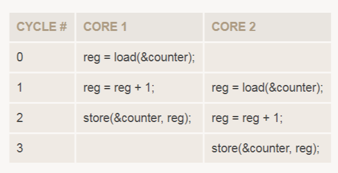

## Atomic operations and contention

> [原文链接](https://fgiesen.wordpress.com/2014/08/18/atomics-and-contention/)

Last time, we covered the basics of how cache coherency works. Today, let’s talk about some of the primitives necessary to build useful systems on top of a coherent cache, and how they work.

Atomicity and atomic operations
A crucial building block for all of this are atomic operations. This has nothing to do with nuclear physics and everything to do with the root of the word atom, the Ancient Greek “ἄτομος” (atomos, “indivisible”). An atomic operation is one that cannot by divided into any smaller parts, or appears to be for the purposes of other cores in the system. To see why this matters, consider what happens when two cores both try to increment a counter at almost the same type, running the equivalent of the C statement counter++;:

In compiled code, this single turns into a load operation, a register increment, and finally a store operation (here written in C-esque pseudocode). These three steps are distinct and will execute in sequence (note that on the micro-architectural level, this is true on x86 as well, even though the instruction set architecture actually features a read-modify-write add [memory], value instruction). And because of this splitting into multiple cycles, it’s possible for Core 2 to read counter after Core 1 has read it (and started incrementing it), but before it has written the result back. The end result is that, even though both cores ran code to increment the counter, the final value of the counter is only incremented by 1; one of the two increment operations was “lost”.

This problem is exactly what atomic operations are there to prevent; if we use an atomic increment (or more generally, atomic add) instead of a regular increment, the active core will make sure that the three steps above (load, add, store) appear to happen as one operation, hence atomic; no other core is allowed to “peek” while the increment is going on.

How atomics are implemented
Now the question is, how is this done? Conceptually, the easiest way to do this is using a locking mechanism: only one core is allowed to execute an atomic operation at any point in time. The core enters the lock before it starts the operation, and leaves it once the operation is complete. This is what the x86 LOCK prefix originally used to mean (approximately; I’m simplifying here). Here, the lock enter operation consists of a message on the bus that says “okay, everyone, back off the bus for a bit” (for our purposes, this means “stop doing memory operations”). Then the core that sent that message needs to wait for all other cores to finish memory operations they’re in the middle of doing, after which they will acknowledge the lock. Only after every other core has acknowledged, the core attempting the locked operation can proceed. Finally, once the lock is released, it again needs to send a message to everyone on the bus saying that “all clear, you can resume issuing requests on the bus now”.

This works. It is also incredibly slow. x86 CPUs still support this (or an equivalent), but only as an absolute emergency, when-all-else-fails fallback path; they need a fallback because the x86 ISA permits very dubious constructs like unaligned atomic operations that cross multiple cache lines, for backwards compatibility. Other architectures generally just don’t allow atomic operations on values that aren’t naturally aligned, nor on values that are “too big”. These constraints guarantee that a single atomic operation always takes place within a single cache line. And once we have that, we’re in good shape: as we saw last time when discussing cache coherency protocols, inter-core communication synchronizes memory at cache line granularity anyway, so in principle we can do complex modifications to a single cache line and then publish all changes at once by pushing the new cache line. Moreover, the MESI state machine features two states (M and E, “modified” and “exclusive”) that guarantee exclusive ownership of a cache line by one core – while a cache line is exclusively owned, no other core can “peek”. We can use that as substitute for our locking protocol.

So here’s the punchline: in a MESI (or derived) system, all we need to do to make sure an operation touching a single cache line is atomic is to a) make sure we issue the right memory barriers so memory operations are correctly ordered with reference to the surrounding code (see previous post), b) acquire exclusive ownership of the cache line before we read anything, c) only write back the results if we had exclusive ownership for the entire duration of the atomic operation. This guarantees that no other core saw any half-finished data. There’s multiple ways to accomplish c). For example, we can build hardware to make a limited set of atomic operations complete in a single bus clock cycle; if we have exclusive ownership of our cache line by the start of a cycle, we can have our modified data by the end of it. Since a cache line can’t possibly “change hands” within a cycle, this is fast enough. Depending on the bus protocol, we might also start playing games where we respond to coherency messages immediately, but might send the data a bit late if we’re in the middle of an atomic operation. Finally, we can just decide not to play games with timing at all; instead we implement steps b) and c) directly: any cache line that’s being used for an atomic operation is “monitored”, and if some other core looks at our cache line before the atomic operation is complete, we need to start over. This is what leads to the load-link/store-conditional (LL/SC) operations present in most RISC CPUs.

And by the way, on the bus side (and hence to other cores), properly aligned atomic operations don’t look any different than normal memory updates. Again, all of the processing is internal to the core that does it; other cores neither know nor care whether memory was updated from an atomic compare-and-swap operation bracketed by memory barriers or a relaxed store.

This all sounds nice and simple, and conceptually it is, but the devil’s in the details. The bad news is that if you’re a CPU architect, every single detail of this process is of crucial importance; your internal implementation of memory operations needs to avoid starvation (every core that wants to gain exclusive access to a cache line should be able to do so, eventually, no matter what the other cores are doing), and make sure that it’s possible to implement certain fundamental atomic operations without deadlocks or livelocks. It sounds obvious, but these guarantees are not automatic for low-level primitives like atomic operations or LL/SC. This stuff is hard to get right, and CPUs need to have an implementation that’s not just correct, it also needs to be fast for “typical cases” (whatever they are). The good news is that if you’re not working at a company designing CPUs, none of this is your problem, and you can rest assured that somebody else has thought this through, backed up by an army of validation engineers trying very hard to find test cases that break it.

The cost of memory operations
Back on the SW side, let’s assume we’re on a typical CPU architecture and are running code on multiple cores. What’s the cost of a memory operation in that environment? It breaks down into several components:

Execution. Executing a memory operation isn’t free. Suppose for now that only one core is active and running single-threaded code; even then, memory access is still complicated. Programs deal with virtual addresses, but coherent caches and memory buses normally deal exclusively in physical memory addresses. So every memory operation first starts with a virtual to physical address conversion (these are itself cached in the what’s commonly called Translation Lookaside Buffer or TLB). If you’re unlucky, that virtual address isn’t currently mapped to physical memory and needs to be brought in from storage; whenever this happens, the OS is going to schedule another thread on the active core for a while, since IO takes a long time in processor terms. But let’s assume that doesn’t happen here.

With the physical address known, the operation starts to go through the memory hierarchy. For example, to complete a memory load, the relevant data normally needs to be brought into the L1 cache first. If it’s not there yet, this can be a multi-step process that – in the worst case – involves a real memory access and then populating all the intermediate cache levels for the relevant cache line. With poor (i.e. not nicely localized) memory access patterns, waiting for cache levels to get populated is one of the main ways a CPU core spends its time. But for now, let’s assume that doesn’t happen (too often) either.

So how fast can we run memory operations if everything goes well? Pretty fast, it turns out. Usually at least one operation (loads/stores) completed per clock cycle, often more than that. Reasonably cache-friendly code will complete billions of memory operations per second on a single 3GHz core.

Memory barriers and atomic read-modify-write operations. For the next step, let’s suppose we’re running code that’s intended for multi-threaded operation, but we’re still doing so on only a single core. As a result, we will now see memory barriers and atomic operations, but no actual interference from another core; let’s just suppose that all relevant cache lines are already exclusively held by our own core. In that situation, how expensive is, say, updating a reference count using an atomic integer addition?

Well, that really depends on the CPU core. In general, micro-architectures with aggressive reordering of memory operations have more expensive memory barriers and atomic operations than those with only slight reordering or in-order execution of memory operations. For example, incrementing a reference count using LOCK INC [mem] on an Intel Atom core (an in-order design) has essentially the same cost as a regular INC [mem] instruction, and somewhat more complicated atomic operations like exchange or exchange-add end costing about 2x to 3x as much as a “vanilla” memory read-modify-write instruction. By contrast, on Intel and AMD’s out-of-order x86 desktop parts, an atomic increment has about 10x-25x the cost of the non-atomic version; that’s the cost of ensuring proper memory ordering. And again, to reiterate: this is still on code that is executing single-threaded. There’s no actual cross-core communication going on yet; this extra cost is incurred purely within a single core, to make the code safe for multi-core execution.

Bus traffic and cache coherency. Some percentage of memory accesses actually misses the cache and goes straight to memory; and once cache line that haven’t been used in a while get evicted, we start getting write-backs. All these events cause bus traffic (and memory traffic). Bus and memory bandwidth is a limited resource; as we start saturating their capacities, things start to get slower.

Moreover, once we switch to running multiple threads of our program on multiple cores, we actually start getting cache coherency traffic, as the cores continually synchronize their respective views of memory. If every thread works on its own independent memory region, this doesn’t really do much; if a given region of memory is only used by one core, then there’s no sharing, and getting exclusive ownerships of one of the corresponding cache lines is easy and doesn’t cause any invalidations elsewhere.

By contrast, if two or more cores frequently access the same cache lines, then these cache lines need to be kept synchronized. Updates to one of these cache lines require exclusive ownership, which means all other cores need to invalidate their copies of that cache line first. As a result, the next time that cache line is accessed by another core, its contents need to be sent across the bus. So we get both extra cache misses (on the remote core) and extra bus traffic. This phenomenon of multiple cores hitting a cache line that is being updated regularly is called “cache (line) contention”, and it is probably the easiest way to make parallel code in shared-memory environments crawl.

Cache line contention
To get cache line contention, we need multiple cores frequently accessing the same cache line, with at least some of these regular accesses being writes. Private data (cache lines only accessed by one thread) is never a problem; neither is immutable data (written once and then not modified until the end of its lifetime). What’s tricky is data that is both shared and mutable: doing so requires a lot of communication to maintain a consistent (as per the constraints of the memory model) view of memory between cores, and communication is expensive – and only keeps getting more so as more parties get involved.

How much more expensive are we talking? I wrote a test (for x86/Windows) a few weeks ago. This test is by no means user-friendly or easy to read, and it assumes a quad-core CPU with simultaneous multi-threading, or a similar topology, with at least 8 logical processors. Here’s the gist of it: as explained above, replacing a read-modify-write add of a value in memory with an atomic “add” operation generally makes it about 10x-25x as expensive (how much exactly depends on the micro-architecture). If you need a rule of thumb, just assume about 10x (good enough for Fermi estimation).

Once there is a second core reading that cache line, though, the cost explodes. If there’s another core generating lots of read traffic on the cache line in a tight loop, the atomic add gets more expensive – much more expensive: typically, 4x to 6x more (that’s on top of the ~10x hit we take from using an atomic add to begin with!). And this cost only goes up if there are more readers, and even more so if there are other writers too. Now, please don’t take these values as gospel; this is a completely synthetic benchmark that doesn’t do anything useful. The actual cost of coherency traffic very much depends on context. All I want to do here is give you a very rough feel for the cost of coherency traffic and the communication it does (namely: it’s not negligible).

Some of this communication is not actually necessary. For example, because cache coherency is tracked at cache line granularity, it’s possible to get lots of bogus coherency traffic simple because the different types of data – immutable, private and shared – are intermingled within the same cache line (or similarly, because one cache line contains private data for multiple threads). This is called “false sharing“. Luckily, this kind of problem is fairly easy to find with a profiler, and also relatively straightforward to fix by either reordering the data in memory (possibly while adding padding to make sure two different kinds of data don’t end up in the same cache line) or just removing some of the offending data entirely. My older post “Cores don’t like to share” gives an example.

What’s left over after this process is “real” contention – contended access to shared data. This includes both actual shared mutable data structures and certain kinds of metadata such as locks and other synchronization objects. Exactly how well this works depends on the precise layout of data in memory, as well as the operations used to access it.

In general, the way to get scalable multi-processor code is to avoid contention as much as possible, and to make whatever contention remains pass quickly – in that order. And to do a decent job at this, it’s important to know how cache coherency works (in broad strokes, anyway), what kind of messages cores exchange to maintain memory coherency, and when that coherency traffic happens. Now that we have those basics covered, we can look at somewhat higher levels of the stack. This post is long enough already, but in the next post, I’m planning to have a look at locks and lock-free data structures, and discuss some of the trade-offs. Until then, take care!