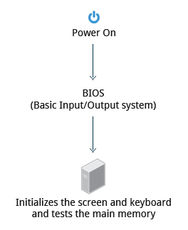
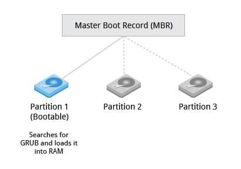
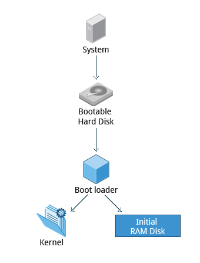
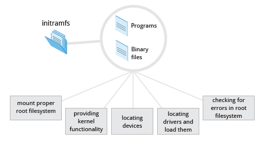
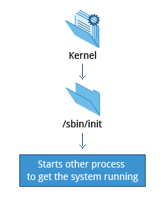
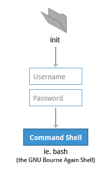
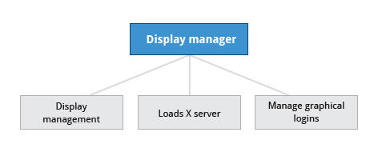

## 【译】从你按下电源到Linux登录框出现,这背后都发生了什么

> 原文 [《what happens in the background from the time you press the Power button until the Linux login prompt appears?》](https://leetcode.com/discuss/interview-question/124638/what-happens-in-the-background-from-the-time-you-press-the-Power-button-until-the-Linux-login-prompt-appears/?orderBy=most_votes)<br/>
> 译者：[Lvsi](https://github.com/Lvsi-China)

### 前言 

这是一个简单的教程，一步一步的展示在Linux的启动过程中所发生的事情。因为我被多次问到这个问题，因此，想给大家分享一些我在这方面做的笔记。

当然，你不必记得所有的细枝末节，虽然学习它们是一件好事，但主要是希望你们对启动过程有一个总体的理解并记住一些术语。

**从你按下电源到Linux登录框出现,这背后都发生了什么**


### 第 1 步：BIOS 



```BIOS```基本输入输出系统(Basic Input/Output System)初始化硬件，包括显示器和键盘，并检测内存。这个过程也叫做```POST```(Power On Self Test).

```BIOS```存储在主板的```ROM```芯片中。在这之后，启动过程的剩余部分全部由操作系统控制。

### 第 2 步： 主引导记录(MBR)和引导程序(Boot Loader)



一旦 ```POST``` 完成，系统的控制器就从 ```BIOS``` 传给了 ```Boot Loader```。启动程序通常存储在系统中的一个硬盘上，或者存储在```Boot Sector```引导扇区(对于传统的 **BIOS/MBR** 系统)。到此阶段，机器不再访问任何大容量存储介质。

此后，有关日期，时间和最重要外设的信息都是从 CMOS 中加载(使用了电池供电的存储器技术之后 - 即使在断电时，系统也可以跟踪日期和时间)。

Linux系统内存在着一些引导程序，最常见的是**GRUB**(GRand Unified Boot loader)和**ISOLINUX**(从可移动介质中引导)。大多数的Linux引导程序提供用户界面，用于选择引导Linux的备用选项，甚至是安装其他的操作系统。引导Linux时，引导加载程序负责将```Kernel Image```和初始的```RAM disk```(包含启动系统所需的一些关键文件和设备驱动程序)加载到内存中。

### 第 3 步 : 引导程序实战



引导程序有2个不同的阶段：

#### 第1个阶段

对于使用BIOS/MBR的系统，引导程序驻留在硬盘的第一个扇区(也称为```主引导记录MBR```)。```MBR```的大小只有512个字节。 在此阶段，引导程序检查分区表并找到可引导分区。 一旦找到可引导分区，它就会搜索第二级引导程序，例如GRUB，并将其加载到RAM(随机存取存储器)中。

#### 第二阶段

第二阶段的引导程序位于```/boot```下。将显示一个启动屏幕，允许我们选择要引导的操作系统（OS）。 选择操作系统后，引导加载程序将所选操作系统的内核加载到RAM中并将控制权传递给它。 

引导加载程序加载选定的内核映像（在Linux的情况下）并将控制传递给它。 内核几乎总是被压缩，所以它的第一个工作就是解压缩自己。 在此之后，它将检查并分析系统硬件并初始化内核中内置的任何硬件设备驱动程序。

### 第 4 步 : Linux 内核


引导加载程序将内核和基于RAM的初始文件系统(initramfs)加载到内存中，以便内核可以直接使用。 

当内核加载到RAM中时，它会立即初始化并配置计算机的内存，并配置连接到系统的所有硬件。 包括所有的处理器，I/O子系统，存储设备等。内核还会加载一些必要的用户空间的应用程序。

### 第 5 步 : 初始 RAM Disk



initramfs文件系统映像包含执行安装正确的根文件系统所需的所有操作的程序和二进制文件，例如为大容量存储控制器提供所需文件系统和设备驱动程序的内核功能，以及负责用户设备udev（用户设备）的工具找出存在哪些设备，找到正确操作所需的驱动程序，然后加载它们。找到根文件系统后，将检查错误并装入。 

```mount```程序给操作系统指示文件系统可以使用，并将其与文件系统整体层次结构中的特定点(挂载点)相关联。如果成功，则从RAM中清除initramfs，并执行根文件系统(/sbin/init)上的init程序。 

init负责处理安装并转移到最终的真实根文件系统。如果在访问大容量存储之前需要特殊的硬件驱动程序，则它们必须位于initramfs映像中。

### 第 6 步 : /sbin/init 和服务



一旦内核设置了所有硬件并挂载了根文件系统，内核就会运行 ```/sbin/init```程序。之后，这将成为初始进程，然后启动其他进程以使系统运行。系统上其他大多数的进程的最原始进程都是```init```进程，不过内核进程是例外，它由内核直接启动以管理操作系统内部的细节。

传统上将，这个启动过程使用的规定，可追溯到UNIX的```System V ```，系统通过一系列运行级别，其中包含启动和停止服务的脚本集合。每个运行级别都支持不同的运行系统的模式。在每个运行级别中，可以将各个服务设置为运行，或者在运行时停止。较新的发行版正在逐渐脱离```System V```标准，但出于兼容性目的，通常支持```System V```规定。

除了启动系统外，```init```还负责保持系统运行并干净地关闭系统。它充当所有非内核进程的“最后管理者”，必要时在它们结束之后会进行清理，并在用户登录和注销时根据需要重新启动用户登录服务。

### 第 7 步 : 文本模式登录



在启动过程即将结束时，```init```会启动一些文本模式的登录框(由```getty```程序完成)。 以便你可以键入用户名，然后输入密码，最终获得命令shell。 

通常，默认的命令shell是bash(GNU Bourne Again Shell)，但是还有许多其他高级的命令shell可以使用。shell打印出一个文本提示，表示它已准备好接受命令。用户键入命令并按Enter键后，命令就会被执行，在命令完成后会显示另一个文本提示符。

### 第 8 步 : 窗口系统



通常，在Linux桌面系统中，窗口系统在引导过程的最后一步被加载。 

界面管理器的服务是跟踪启动的界面，并加载XX服务器(之所以这么叫是因为它为应用程序提供图形服务，有时称为XX客户端)。 显示管理器还处理图形界面的登录，并在用户登录后启动适当的桌面环境。