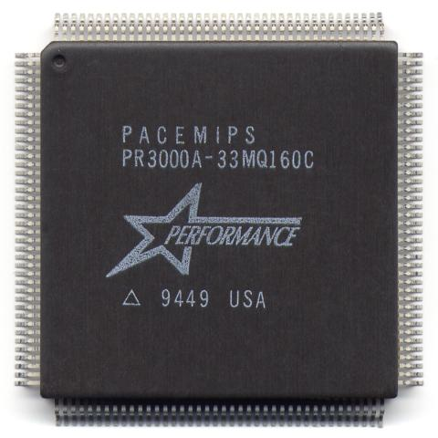
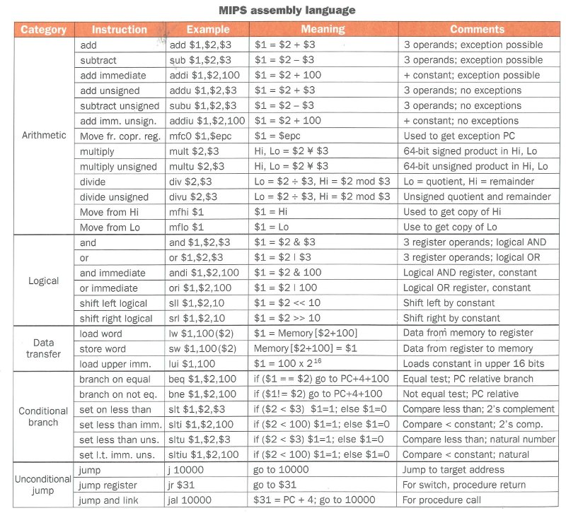

# 【译】指令集架构设计

## 1. 介绍

- 在此演讲中，我们将研究指令集架构设计(ISA:Instruction Set Architectures)背后的原理和相关问题。
- 之后，我们会对比了解两种主要的指令集架构设计(RISC 和 CISC)原理的优点和缺点。
- 最后，我们会用一个例子来详细介绍 ISA，并用它来介绍课题的剩余内容 : MIPS架构。
- 在学习旅行结束的时候，回顾一下刚才所学到的知识对你很有用，思考```MIPS```架构是如何反映出```ISA```设计背后原理的。

## 2. 设计指令集和CPU

- 我们在设计ISA时的目标是使CPU具有足够的功能，以便程序员可以为其编写程序。
- 正如我们上周所看到的，我们需要满足基本数学运算，数据比较，处理不同大小的数据，以及分支和跳转的指令( 因此在代码中我们可以实现```决策```，```循环```和```函数``` )。
- 我们可以通过无数种方式去构建指令集来实现上述目标，因此我们还需要在此过程中做出其他一些设计决策。
- 但是，我们制定的任何设计决策都会成为限制我们所有其他设计决策的约束。
- 实际上，任何完整的设计都是妥协的集合，总体上尽可能接近实现我们的原始目标。
- 因此，我们要牢记我们最重要的设计目标是什么，以及我们可以妥协的目标是什么。

## 3. ISA 基本问题

### 3.1 寄存器

- 我们或许需要一些寄存器，这样就不必访问速度缓慢的内存，但我们想要或需要多少个寄存器呢？
- 更多的寄存器可能会更好，但这会使CPU的实现变得更加复杂，因此我们需要在编程的简易性和CPU的构建复杂程度之间进行权衡。
	- 在指令中我们需要一些位来表示寄存器号：8个寄存器 = 3位 等其他的。
- 这也意味着当我们在程序之间切换时必须使用保存更多的寄存器来保存运行环境，因为我们确实希望系统可以支持同时运行多个程序。
- 反之，寄存器太少，则意味着我们将不得不更加频繁地去访问主存。
- 另一个问题是我们如何处理特殊的寄存器，如程序计数器(PC)：我们是否希望程序员可以看到并访问这些寄存器？
	- 这将允许程序员手动更改PC的值，这可能是非常有用的。
	- 或者我们是否应该提供特殊的指令来以有限的方式去操纵一些寄存器呢？
- 大多数现代的ISA都有8到32个寄存器。

### 3.2 总线规模

- 我们想要多少根数据总线？这决定着ISA的固有字长。
- 由于CPU以字为单位获取，这也会影响指令的大小。
	- 通常，每个指令最小为1个字，或者是字的倍数。
- 我们需要多少根地址总线，这决定着CPU的寻址范围。
- 但是，我们需要能够以某种方式表达每个地址。
- 如果地址大小太大，也就可能使指令的大小过大。
- 例如，如果地址总线是64位，我们将如何编码操作：将地址XX中的字加载到寄存器R3中？
	- 该指令至少需要64位来保存地址，加上用于指明加载操作的位和目标寄存器。

### 3.3 操作

- 我们需要多少个操作？
- 如果我们有很多，这会给程序员提供可以执行的丰富操作，但在硅中实现它们将会变得更加困难。
- 在每条指令中我们还需要使用更多位来编码操作：
	- 5位=> 32次操作，6位=> 64次操作等
- 从另一方面讲，我们可能只会去选择短小简单的指令集。这可能会迫使程序员必须组合2个或更多指令来完成某些操作，但优点是编码操作所需的位数更少，CPU设计更简单。

### 3.4   有多少个操作数？

- 根据决定的指令数量，每个操作需要多少个操作数？
- 如果CPU从寄存器中获取大部分数据，那么我们可能希望有一些3操作数指令
	- 添加R1，R2，R3，即添加R2和R3，并将结果保存到R1中
	所以指令格式需要留出位以识别三个寄存器中的每一个。
- 其他3操作数指令包括​​比较然后将PC转移到新指令的指令，例如
	BGT R1，R2,100，即如果R1> R2，则将CPU分支到当前PC + 100的指令
- 并非所有说明都有3个操作。2操作数 指令的示例包括：
	LOAD R3,4000，即从存储单元4000获取值并将其加载到寄存器R3中。
	保存R4,5000，即将R4的值写入存储单元5000。
	SET R6,23，即将R6设置为文字值23（不是位置23处的值）。
- 当然，CPU设计人员可能会想到1操作数指令，例如：
	INCR R4，即增加R4中的值。Java等价物是R4 ++。
- 稍后，我们将讨论CPU设计人员可能希望使用的各种寻址模式。

### 3.5 字面值

- 许多指令都需要字面值。
	例如，在Java中，当我们写入（i = 0; i <100; i ++）时，有两个文字值：0和100。
- 我们是否能够在每条指令中找到空间来输入字面值？
- 如果是这样，那将是很好的，但如果程序没有很多文字值，那将是浪费空间。
- 如果我们找不到空格，那么每次有文字时，它都必须存储在寄存器中，否则我们将不得不去内存来获取文字值。

### 3.6   指令格式
- 每个不同的指令必须以不同的方式编码：操作，操作数，文字值，放置结果的位置，操作数据的大小等。
- 什么是指令格式？
- 我们可以使每条指令的大小相同，或者某些指令的大小不同吗？
- 是否会有单一格式，这使得硅片中的解码变得容易，或者我们是否会有几种不同的指令类型，每种类型都有不同的格式？

### 3.7   一个假设的例子
- 在我们进一步讨论之前，让我们通过做一些ISA设计来制作上述具体内容。
- 让我们设计一个带有8个寄存器，16位数据总线和字大小以及24位地址总线的ISA：非常适合嵌入式CPU，例如微波炉或发动机控制系统。
- 我们还有3操作数指令，其中操作数是所有寄存器：R dest = R src1   OP R src2
- 我们需要3位来编码每个寄存器的编号，因此16位中的9位用完，留下7位。
- 让我们使用1位来编码被操作数据的大小：8位字节或16位int。留下6位。
- 我们可以选择一种指令格式：

| Operation | Size | Rdest | Rsc1 | Rsc2 |
| --- | --- | --- | --- | --- |
| 6 bits | 1 bit | 3 bits | 3 bits | 3 bits |

但是现在没有办法在寄存器和主存储器之间复制值，也没有办法将文字值放入指令中。

- 让我们添加第二个指令格式，仍然是16位长，但包含一个文字值：

| Inst Type	 | Operation | Size | Rdest | Rsrc1 | Rsrc2 |
| --- | --- | --- | --- | --- | --- |
| 0 | 5 bits | 1 bit | 3 bits | 3 bits | 3 bits |

| Inst Type	 | Operation | Size | Register | Literal Value |
| --- | --- | --- | --- | --- | --- |
| 10 | 2 bits | 1 bit | 3 bits | 8 bits |

- 这允许我们执行SET R0,26之类的操作，其中26存储在8位字面部分中。
- 但是我们仍然无法访问内存中的位置，因此有一种最终的指令格式：

| Inst Type	 | Operation | Size | Register | Memory Location |
| --- | --- | --- | --- | --- | --- |
| 11 | 2 bits | 1 bit | 3 bits | 24 bits |

- 该指令格式为2个字长，存储器地址指定为24位值。这允许我们做LOAD R0,4000和SAVE R4,5000之类的事情。
- 我们现在有：
	- 一个1字的指令格式，在3个寄存器操作数上有2 5 = 32个可能的操作，
	- 一个1字的指令格式，在一个寄存器上有2 2 = 4个可能的操作和8位字面值，和
	- 一个2字的指令格式，在一个寄存器和24位存储器位置上有2 2 = 4个可能的操作

### 3.8   决策
	
- 到目前为止，我们还没有考虑过如何修改PC中的值，以便它可以偏离正常的“下一条指令”执行流程。
- 我们需要一种基于决策跳过指令的方法，以便实现IF语句。
- 我们还需要根据决策向后分支，以便实现循环结构。
- 我们需要跳到函数的开头，并且知道如何返回到我们离开的位置。
- 以上所有内容都会更改默认的PC行为：移动到下一条指令的地址。
- 我们将提供什么决定？==，！=，<，<=，>，> =？
- 其中一些我们可以省略，例如，如果（R3 <R4）与（R4> R3）相同。
- 这里有几种选择。我们可以设计一个编码的指令格式：
	- 要比较的两个操作数，
	- 要做什么类型的比较，
	- 如果比较结果，对PC进行了哪些更改。
- 例如：

| 	 |  |  |  |
| --- | --- | --- | --- |
| R3 | < | R4 | skip ahead 4 instructions |

- 另一种方法是使状态寄存器具有根据最后一条指令的结果设置为开/关的位标志，以及根据状态寄存器中的哪些位进行分支的其他指令。
- 例如，让我们的最后一个结果是零（Z）标志，最后一个结果是负（N）标志。其他常见标志保存ALU的进位和溢出输出。
- 我们现在可以有几个分支指令：
	- 如果Z == 1，则转移到指令X，即最后一条指令的结果为0。
	- 如果Z == 0，则转移到指令X，即最后一条指令的结果不为0。
	- 如果N == 1，则转移到指令X，即最后一条指令的结果是否定的。
	- 如果N == 0，则转移到指令X，即最后一条指令的结果为正。
	- 如果N == 0且Z == 0，则转移到指令X，即最后一条指令的结果为正且不为零，即> 0。
- 鉴于上述情况，我们现在可以通过减法操作进行这些比较：

| We Want | We Perform | The Result	 | Z becomes | N becomes |
| --- | --- | --- | --- | --- |
| if R1 == R2 | R1 - R2 | is 0 if true | 1 if true | 0 if true |
| if R1 != R2 | R1 - R2 | is not 0 if true | 0 if true | don't care |
| if R1 < R2 | R1 - R2 | is < 0 if true | 0 if true	| 1 if true |
| if R1 <= R2 | R2 - R1 | is >= 0 if true | don't care | 0 if true |
| if R1 > R2 | R1 - R2 | is > 0 if true | 0 if true	 | 0 if true |
| if R1 >= R2 | R1 - R2 | is >= 0 if true | don't care | 0 if true |

- 现在让我们将注意力转向两种最流行的ISA设计理念：RISC和CISC。
- 它们在如何实现目标方面几乎截然相反，但目标是相同的：设计一个具有足够功能的ISA，以便程序员可以为其编写程序。

### 4. CISC : 复杂指令集计算

- 在早期的计算时代，ISA设计受到很多限制：
	- 记忆很贵。
	- CPU由少数分立晶体管或具有少量集成晶体管的芯片制成。
- 由于这些原因，设计人员希望ISA能够将指令打包到尽可能少的位; 同样，由于晶体管数量有限，CPU无法承受太多的寄存器。
- 同时，大多数程序员仍在使用汇编程序，即靠近指令集，或使用必须转换为指令集中可用指令的早期编译器。
- 在程序速度和内存的有效使用方面，对编译过程的效率也存在不信任。
- 由于上述所有压力，ISA设计人员创建了具有执行所有操作的指令的指令集，并且指令本身执行复杂的操作。这种类型的指令集现在称为CISC架构。
- CISC ISA使程序员更容易编写程序集，同时，它们使循环和函数调用等高级抽象转换变得更加容易，从而有助于编译器编写者。
- 随着寄存器的减少，存储器访问量增加，CISC指令也提供了许多复杂的寻址模式，以类似于高级结构（如指针，单维和多维数组，结构和对象，链表等）的方式访问存储器。 。
- 为了支持所有这些寻址模式以及指定它们所需的操作数，CISC指令的长度通常是可变的。
- 因此，执行CISC指令的存储器访问次数可以从1（指令获取）变化到几个，例如取指令，操作数获取的地址，该地址的值获取，使用该值作为获取另一个的指针value，同样为第二个操作数，执行操作，将结果写回内存。
- 这意味着CISC指令需要花费不同的时间来执行，具体取决于它们的复杂性和所需的内存访问次数。
- VAX ISA设计于20世纪70年代后期，被认为是CISC理念的缩影。
- 它有16个32位寄存器，11种不同的数据类型，15种不同的寻址模式，大小范围从1字节到大约60字节的指令，以及如下指令：
	- LOCC：在字符串中定位字符
	- CRC：计算循环冗余校验
	- CVTPL：将压缩十进制字符串转换为长字
	- INSQUEUE：将元素插入队列
- 有关VAX和MIPS ISA的良好比较，请阅读 Patterson和Hennessy的[本附录](https://minnie.tuhs.org/CompArch/Resources/webext3.pdf)。
- 用于80386,80486，奔腾CPU及其后代的[英特尔IA-32](https://en.wikipedia.org/wiki/IA-32) ISA也是一种强大的面向CISC的架构。
- IA-32只有4个通用寄存器，几个专用寄存器，包括PC，状态寄存器和几个存储器管理寄存器。
- 指令是可变长度，从1到几个字节。有几种寻址模式和数据类型，但没有VAX那么多。
- IA-32提供了[数百条指令](https://en.wikipedia.org/wiki/X86_instruction_listings)，随着架构的发展不断添加新的指令（例如MMX，SSE，SSE2）。

### 5. RISC：减少指令集计算
- 在20世纪70年代，随着存储器尺寸和晶体管数量的增加，对CISC产生了强烈抵制。
- 一些研究人员证明，一些更复杂的CISC指令实际上比一系列更简单的指令需要更长的时间。
- 而且，许多深奥的指令和寻址模式根本没有被程序员或编译器使用。例如，要使高级构造的转换自动化以利用CISC架构的所有功能，实在太难了。
- 随着更多的CPU晶体管，需要限制寄存器的数量，这也降低了CPU访问主存储器所需的频率。
另一位研究人员还指出，程序中使用的所有文字值中有98％可以用13位或更少的数字表示，但这些值在CISC设计中存储为16位或32位值。
- 所有这些都推动了设计向ISA架构的转变，其中指令更简单，寄存器更多，寻址模式的数量减少，指令格式简化为只有1个字长：减少指令集计算或RISC。
- 这里的“减少”一词用词不当。这并不意味着操作的数量减少了（尽管确实发生了这种情况），但是可用的指令执行的任务比CISC对应的更简单，例如没有像VAX INSQUEUE指令那样的指令。
- 通过更简单的指令集和简化的指令格式，芯片上可用的晶体管可以从解码部分取出并用于提高CPU性能：
	- 引入了流水线技术，其中几个指令可以在解码和执行的各个阶段同时通过CPU
	- 有更多的晶体管来创建CPU数据和指令缓存
	- 由于简化的操作和指令格式，CPU的时钟速度可以增加。
- 典型的RISC特征包括（来自维基百科）：
	- 统一指令格式，在每条指令的相同位位置使用单个字和操作码，要求较少的解码;
	- 相同的通用寄存器，允许在任何上下文中使用任何寄存器，简化了编译器设计（尽管通常有单独的浮点寄存器）;
	- 简单的寻址模式。通过算术和/或加载 - 存储操作的序列来执行复杂寻址;
	- 硬件中的数据类型很少，一些CISC具有字节串指令或支持复数; 这不太可能在RISC上找到。
- 虽然英特尔的IA-32架构已经成为台式机和笔记本电脑上的主流ISA设计，但RISC CPU也很受欢迎，并在嵌入式设备，游戏机和移动电话等低功耗环境等领域占据了一席之地。
- RISC CPU的示例包括：
	- ARM，用于Apple的iPhone，iPod和iPad以及大多数Android手机等设备。
	- PowerPC，用于Nintendo Wii，Gamecube和网络设备，如交换机和路由器。
	- 飞思卡尔的Power Architecture，用于Xbox 360和Playstation 3。
	- Atmel AVR，用于汽车等嵌入式环境。
- 对于本课程的其余部分，我们将使用RISC架构MIPS ISA作为我们的代表架构，用于学习指令集和检查CPU实际工作方式。
- MIPS是最先进的基于芯片的RISC架构，最初于1981年在斯坦福大学设计，是最早用于提高性能的CPU之一。
- 第一个MIPS CPU R2000于1985年发布，此后ISA系列的其他几个成员也已发布。
- 现在由于最近ARM ISA的成功而有所作为，MIPS已被用于诸如PlayStation，PlayStation 2，Nintendo 64，PlayStation Portable以及Linksys WRT54G系列等嵌入式设备和家用路由器等设备中

### 6. MIPS指令集架构



- MIPS架构是RISC理念的缩影。
- 数据总线大小（和字大小）是32位，地址总线也是32位。
- MIPS支持4种整数数据类型：8位字节，16位半字，32位字和64位双字。
- 还支持浮点类型：32位单精度和64位双精度值。
- MIPS提供32个通用32位寄存器，尽管操作系统，汇编器和库保留了其中一些特殊用途。
- MIPS是加载/存储架构的一个示例：在操作数据之前，必须先将数据从内存加载到寄存器中。结果存储在寄存器中，如果需要，它们必须存储到存储器中。
- MIPS提供了执行以下操作的说明：
	- 从RAM或文字值加载带有值的寄存器。
	- 将寄存器值（即复制它们）存储到RAM位置。
	- 基本整数运算：加，减，乘，除以余数。
	- 基本浮点运算：加，减，乘，除。
	- 逻辑运算：AND，OR，NOR，异或（XOR）。
	- 换班操作：左移，右移。
	- 比较操作：==，！=，<，>，<=，> =
	- 更改控制流程的说明：相对分支和跳转。
- 只有3种指令格式，所有这些格式都是一个字（32位）：
	- R型指令，对寄存器执行算术和逻辑运算。
	- I类型指令，处理加载/存储和直接文字值，以及分支。
	- J类型指令，用于跳转和函数调用。
- 所有三种格式共享相同的6位操作字段，因此这里的不同值决定了每条指令的类型。

#### 6.1 R型指令

| op | rs | rt | rd | shamt | func |
| --- | --- | --- | --- | --- | --- |
| 6 bits | 5 bits | 5 bits | 5 bits | 5 bits | 6 bits |

- R型指令对寄存器执行算术和逻辑运算。
- R型指令格式共有3个操作数和6个字段：
	- op：指令的操作：6位提供最多64次操作
	- rs：第一个寄存器操作数：5位编码所有32个寄存器值
	- rt：第二个寄存器操作数
	- rd：目标寄存器，获取结果
	- shamt：移位金额，现在忽略这个
	- 功能：功能; 此字段修改op字段中指定的操作
- R型MIPS指令的示例如下所示。

| Instruction | op | rt | rt | rd | shamt | func | 
| --- | --- | --- | --- | --- | --- | --- |
| add $1, $2, $3 | 0 | 2 | 3 | 1 | 0 | 32 |
| addu $1, $2, $3 |	0 | 2 | 3 | 1 | 0 | 33 |
| subu $1, $2, $3 |	0 | 2 | 3 | 1 | 0 | 35 |
| mfc0 $1, $epc | 16 | 0 | 1 | 14 | 0 | 0 |
| mult $2, $3 |	0 | 2 | 3 | 0 | 0 | 24 |
| multu $2, $3 | 0 | 2 | 3 | 0 | 0 | 25 |
| div $2, $3 | 0 | 2 | 3 | 0 | 0 | 26 |
| and $1, $2, $3 | 0 | 2 | 3  | 1 | 0 | 36 |
| or $1, $2, $3 | 0 | 2 | 3 | 1 | 0 | 37 |

- 请注意，op通常为0而func更改：也许最好说func指定操作并且op修改它！
- MIPS有几个专用寄存器：
	- HI和LO是32位寄存器，它们是乘法和除法的目的地，这就是为什么mult和div指令似乎只有2个操作数：HI和LO以及隐式目标。
	- 其他专用寄存器如$ epc处理中断和异常，因此mfc0指令允许程序员通过移动到通用寄存器来访问它们的值。

### 6.2 I型指令

| op | rs | rt | address/immediate |
| --- | --- | --- | --- |
| 6 bits | 5 bits | 5 bits | 6 bits |

- I类型指令处理 ```load/store``` 和字面立即值。
- I型指令格式有3个操作数和4个字段：
	- ```op```：指令的操作
	- ```rs```：第一个寄存器操作数：用5位来表示所有32个寄存器值
	- ```rt```：第二个寄存器操作数
	- ```address/immediate```：第三个操作数，可以是字面值，也可以是32位地址的16位
- 注意，直接字段遵循研究，即程序中使用的所有文字值的98％可以用13位或更少的比特来表示。
- I类型指令可用于执行算术，其中一个操作数是文字值，例如

| Instruction | op | rs | rt | immed |
| --- | --- | --- | --- | --- |
| addi $1, $2, 64 | 4 | 2 | 1 | 100 |

- 它们还可用于将8位或16位字面值加载到寄存器中。

| Instruction | op | rs | rt | immed |
| --- | --- | --- | --- | --- |
| lh $1, 400 | 33 | 0 | 1 | 400 |

- 要将更大的值加载到寄存器中，需要两个I类型指令，汇编器将伪指令 转换为多个指令。
- 例如，要将32位字面值0x12345678加载到寄存器$1中，我们可以写入```lw $1,0x12345678```。汇编程序将其转换为两条指令：
	- ```lui```(负载上立即数)指令加载到0x1234的$1的顶部16位，低16位设置为零，
	- 然后```ori```(OR立即)指令将剩余的0x5678加载到$1的低16位。
- 类似地，从存储器加载或存储值的指令需要两条指令，因为存储器地址是32位，而I类型指令中的地址字段只有16位：
	- 第一条指令将地址的一半加载到寄存器中。
	- 第二条指令将寄存器的前半部分与地址字段的后半部分组合在一起，以32位完整的内存地址访问内存，并将其存储在剩余的寄存器操作数中。
- 幸运的是，对于32个寄存器，访问主存储器的需求不那么严重，这减少了对指令的需求。

### 6.3 I型分支
- 因为I类型指令具有字面值，所以它们也可用于执行分支（PC更改是相对的）。
- 请考虑以下高级语言代码片段：
```
  if（i == j）
    f = g + h;  
  f = f - i;
```
- 假设MIPS已将**f,g,h,i,j**存储到**$16到$20的寄存器**中。
- 这可以转换为MIPS指令：
```
bne $19, $20, L1        # skip if (i != j), note the not equals test 
add $16, $17, $18       # f = g + h 
L1: sub $16, $16, $19   # f = f - i
```
- 分支指令在下一条指令的地址中相加或相减，即修改PC，以便跳过指令或循环返回重复指令。

| Instruction | op | rs | rt | immed |
| --- | --- | --- | --- | --- |
| bne $19, $20, 2 | 5 | 19 | 20 | 2 |

- 因为所有指令都是1个字或4个字节长，所以在将立即值添加到PC之前将其乘以4。
- 因此，16位立即值可以向前或向后跳转32,767条指令（不是32,767字节）。

### 6.4 J型指令

| op | target address |
| --- | --- | 
| 6 bits | 26 bits |

- J型指令用于跳转(PC更改是绝对的)和函数调用。
- 26位目标地址乘以4，新值存储在程序计数器中。
- 这使得跳转值为28位，仍然完整的32位可用地址。
- 要跳过超过28位的距离，你需要链式关联多个跳转指令，每个跳转指令大约相隔28位地址。
- 稍后我们将详细探讨分支和跳转指令，以及MIPS寻址模式。
- 现在看下表，这是```Patterson and Hennessy```的一个表，描述了根据函数（不是指令类型）分组的基本MIPS指令。



- 有关更多的信息，请参阅主题[资源页面](https://minnie.tuhs.org/CompArch/resources.html)上的备忘单和教程 。