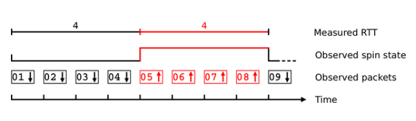
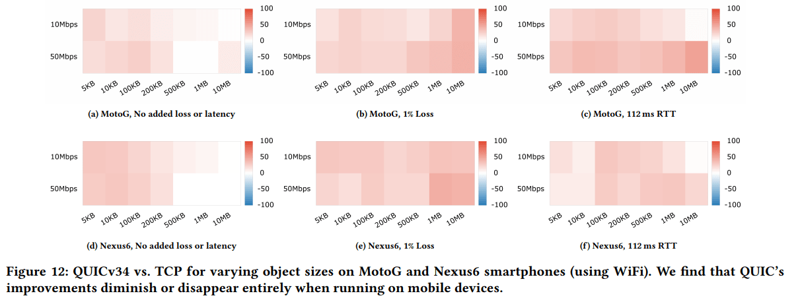
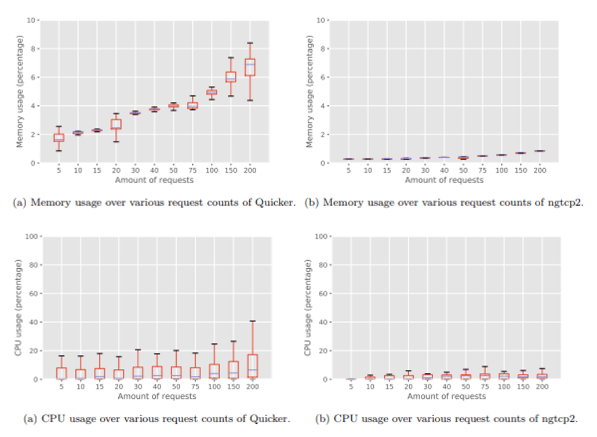
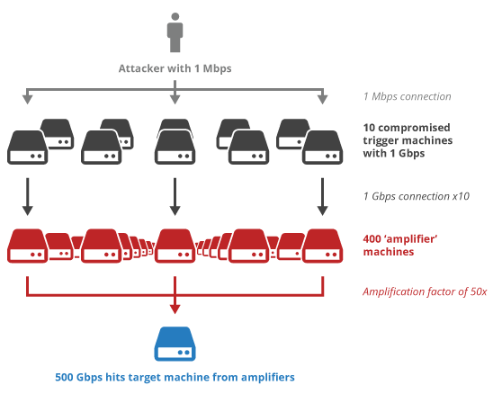
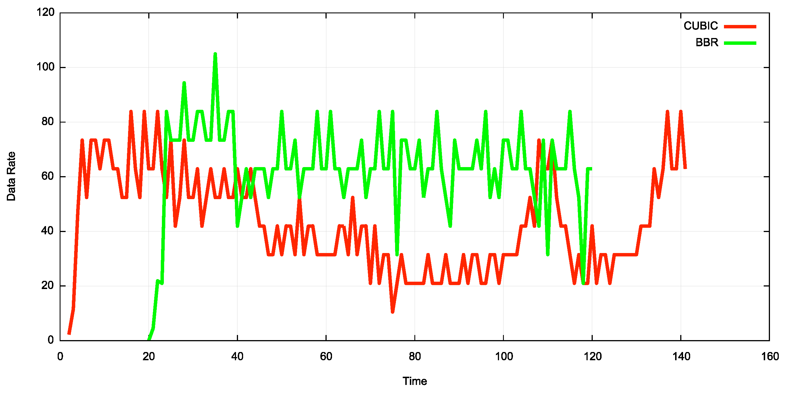
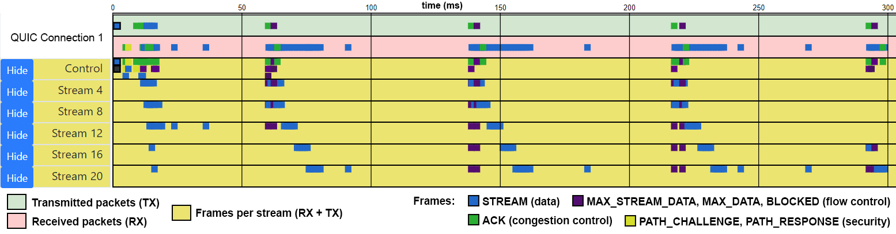

# QUIC和HTTP/3：太大而不能失败？！

> 原文 [《QUIC and HTTP/3 : Too big to fail?!》](https://calendar.perfplanet.com/2018/quic-and-http-3-too-big-to-fail/) 
> 译者：[Wjj](https://github.com/wjj57)
> 校正：[Lvsi-China](https://github.com/Lvsi-China)

新的QUIC和HTTP/3协议即将到来，它们是跨越式的进步！结合30多年网络的经验教训和最佳实践，新的协议栈提供了性能，隐私，安全性和灵活性方面的重大改进。

关于QUIC的潜在好处已经说了很多，其中大部分基于谷歌在早期版本的协议上的经验。然而，它的潜在缺点很少被讨论，对即将到来的标准化版本的属性知之甚少
（[因为它们仍在积极开发中](https://github.com/quicwg)）。这篇文章采用（细微的）“魔鬼的拥护者”观点，并观察QUIC和HTTP / 3在实践中如何仍然失败，尽管当前的热情很大。平心而论，我还会提到每一点的反驳论点，让读者自己构思，希望经过充分的讨论。

> 注意：如果你真的不确定QUIC和HTTP / 3是什么，那么在阅读这篇文章之前最好先加快速度，这需要熟悉这个主题。一些可能对您有帮助的资源：

- Mattias Geniar的[博客文章](https://ma.ttias.be/googles-quic-protocol-moving-web-tcp-udp/)
- Cloudflare的[写作](https://cloudflare-quic.com/)
- 罗伯特格雷厄姆的[评论](https://blog.erratasec.com/2018/11/some-notes-about-http3.html)
- Daniel Stenberg（[@bagder](https://twitter.com/bagder)）的[HTTP / 3解释道](https://daniel.haxx.se/http3-explained/)
- Patrick McManus的[邮件列表解释](https://lists.w3.org/Archives/Public/ietf-http-wg/2017JanMar/0447.html)
和[博客文章](http://bitsup.blogspot.com/2017/04/on-merits-of-quic-for-http.html)
- 我[今年也是来自DeltaVConf的演讲](https://www.youtube.com/watch?v=B1SQFjIXJtc)

## 1. 你说的端到端加密UDP？

QUIC的一大卖点是端到端加密。在TCP中，大部分特定于传输的信息都是公开的，只有数据是加密的，QUIC几乎加密所有内容并应用完整性保护（参见图X）。这样可以提高隐私和安全性，并防止网络中的中间盒篡改协议。最后一个方面是转向UDP的主要原因之一：由于所有不同的实现和解析器，在实践中演进TCP太难了。

> 图X：TCP和QUIC中（加密）字段的简化概念表示

###  网络运营商和旋转位
缺点是网络运营商现在可以更少地尝试优化和管理他们的网络。他们不再知道数据包是确认还是重新传输，不能自行终止连接，并且没有其他方式来
[影响拥塞控制/发送速率](https://www.sandvine.com/hubfs/downloads/archive/whitepaper-tcp-optimization-opportunities-kpis-and-considerations.pdf)而不是丢弃数据包。例如，评估给定连接的往返时间（RTT）也是比较困难的
（如果上升，[则通常是拥塞或缓冲区的标志](https://queue.acm.org/detail.cfm?id=3022184)）。

关于将这些信号中的一些信号添加回QUIC标题的可见线上部分
（[或使用其他方法](https://mailarchive.ietf.org/arch/browse/quic/?q=quic-perf-metrics)）已经有
[很多讨论](https://youtu.be/TQq6Z4_HBaY?t=1357)，但最终结果是只有一个比特将被暴露用于RTT测量： “旋转”位。这个概念是这个位将在每次往返时改变一次值，允许中间盒观察变化并以这种方式估计RTT，参见图Y（更多位可能导致增加分辨率等，
[阅读这篇优秀论文](http://delivery.acm.org/10.1145/3280000/3278535/p22-De_Vaere.pdf?ip=193.190.10.144&id=3278535&acc=OPENTOC&key=D7FC43CABE88BEAA%2E750432B753BA4D90%2E4D4702B0C3E38B35%2E9F04A3A78F7D3B8D&__acm__=1542804087_d7942d7380f88f6149a2ee1404e999c5)）。虽然这
[有点](https://i.kym-cdn.com/photos/images/newsfeed/000/348/126/415.png)帮助，但它仍然大大限制了操作员，特别是初始信号是
[Chrome和Firefox不支持旋转位](https://blog.litespeedtech.com/2018/11/12/ietf-103-http-over-quic-is-now-http-3/)。QUIC唯一支持的选择是“
[显式拥塞通知](https://en.wikipedia.org/wiki/Explicit_Congestion_Notification) “，它使用IP级别的标志来表示拥塞。

> 图Y：旋转钻头 （源）工作的简单说明

### UDP阻塞和具有回退的alt-svc
我不了解你，但如果我是网络运营商（或邪恶的独裁政权），如果我正在进行任何类型的TCP优化或使用特殊的安全措施，我会非常想要阻止QUIC批发。对于网络浏览来说甚至都不会那么困难：在UDP上没有其他任何东西：443（而阻止TCP：443会导致很多混乱）。在部署QUIC时，
[谷歌实际上看了这个](https://www.ietf.org/proceedings/96/slides/slides-96-quic-3.pdf)，知道有多少网络刚刚阻止了UDP / QUIC。他们（和其他研究）
[发现3-5％的网络](https://tools.ietf.org/id/draft-ietf-quic-applicability-03.html#fallback)目前不允许QUIC通过。这看起来很好，但这些数字（可能）并不包括很多企业网络，真正的问题是：它会保持这种状态吗？如果QUIC变得更大，（某些）网络是否会开始主动阻止它（至少在他们更新防火墙和其他工具以更好地处理它之前？）。“有趣”轶事：在使用优秀的
[quic-tracker一致性测试工具](https://quic-tracker.info.ucl.ac.be/grid)测试我们自己的
[QUIC实现的](https://github.com/rmarx/quicker)公共服务器（位于比利时）时，当工具移动到加拿大的服务器时，大多数测试突然失败。进一步测试证实，一些IP路径正在主动阻止QUIC流量，导致测试失败。

问题是阻止QUIC（例如，在公司的防火墙中）甚至不会破坏网络浏览最终用户的任何东西; 网站仍将加载。由于浏览器（和服务器！）无论如何都必须处理被阻止的UDP，它们总是会包含基于TCP的回退（实际上，Chrome目前甚至会竞争TCP和QUIC连接而不是等待QUIC超时）。服务器将使用
[alt-svc](https://curl.haxx.se/video/curlup-2018/2018-04-15_Lucas_Pardue-altsvc-for-the-people.webm)机制来发出QUIC支持信号，但浏览器
[只能在一定程度上信任，因为网络的变化可能突然意味着QUIC被阻止](https://twitter.com/programmingart/status/1063471419990949889)。QUIC阻止公司的网络管理员不会从用户那里得到生气的电话，并且仍然能够很好地控制他们的设置，不喜欢什么？
[他们也不需要在现有的HTTP（/ 2）设置旁边运行和维护单独的QUIC / H3堆栈](https://i.kym-cdn.com/entries/icons/facebook/000/014/499/spackler.jpg)。

最后，有人可能会问：为什么像谷歌这样的大型公司会想要在他们的网络上部署QUIC，如果他们失去灵活性的话？在我的评估中，谷歌（以及其他大型企业）大多数完全控制（大部分）他们的网络，从服务器到链接到边缘存在点，并与其他网络运营商签订合同。他们或多或少知道发生了什么，并可以通过调整负载平衡器，路由或服务器本身来缓解网络问题。他们还可以执行其他恶作剧，例如在QUIC中的少数非加密字段之一中编码信息：连接ID。该字段
[明确允许长达18个字节](https://github.com/quicwg/base-drafts/pull/1088)，以
[允许内部编码（负载平衡）信息](https://tools.ietf.org/id/draft-ietf-quic-applicability-03.html#server-generated-connection-id)。他们也可以想象为
[其数据包添加额外的标头](https://mailarchive.ietf.org/arch/browse/quic/?q=quic-perf-metrics)，一旦流量离开公司网络就将其剥离。因此，大公司会失去一点，但并不多。只有服务器或只有中间网络的较小的运营商或运营商才会失去更多。

### 相反的论点

- 最终用户将要求允许QUIC，因为它提供了（性能）优势
- 无论如何，QUIC不需要性能增强的中间盒，因为它具有更好的内置拥塞控制和更快的连接设置
- 目前大多数网络都没有阻止它，如果没有重大原因/事件，它们几乎没有机会启动
- 在TCP + HTTP / 2旁边运行QUIC + HTTP / 3堆栈就像在服务器配置中添加几行一样简单

## 2. CPU问题
到目前为止，QUIC完全在用户空间中实现（与TCP相反，TCP通常位于内核空间中）。这允许快速和简单的实验，因为用户不需要为每个版本升级其内核，但也引入了严重的性能开销（主要是由于用户到内核空间的通信）和
[潜在的安全问题](https://twitter.com/reykfloeter/status/1064794652065361920)。

在他们的
[开创性论文中](https://dl.acm.org/citation.cfm?id=3098842)，谷歌提到他们的服务器端QUIC实现使用的CPU 大约是等效TCP + TLS堆栈的2倍。这已经在一些优化之后，但不是完全内核旁路（例如，使用DPDK或netmap）。让我换一种说法：他们需要大约两倍的服务器硬件才能提供相同数量的流量！他们还提到移动设备上的性能下降，但不提供数字。幸运的是，
[另文介绍了类似的手机测试](http://david.choffnes.com/pubs/long-look-at-quic-imc17.pdf)，发现谷歌的QUIC大多仍比TCP快，但“QuIC的优势减弱一刀切”，见图?。这主要是因为QUIC的拥塞控制是“应用程序有限”58％的时间（桌面上为7％），这意味着CPU无法应对大量的传入数据包。

> 图Z：QUIC与TCP性能。红色= QUIC更好，蓝色= TCP更好。 （
[资源](http://david.choffnes.com/pubs/long-look-at-quic-imc17.pdf)）

这表明，在网络和高端设备不良的情况下，QUIC比TCP提供了最大的优势。遗憾的是，糟糕的网络通常与糟糕的设备相结合，
[全球网络和设备](https://infrequently.org/2017/10/can-you-afford-it-real-world-web-performance-budgets/)的
[中位数都很慢](https://infrequently.org/2017/10/can-you-afford-it-real-world-web-performance-budgets/)。这意味着QUIC的许多网络收益可能（很大程度上）被较慢的硬件所取消。再加上网页本身也要求越来越多的CPU（
[导致一个声称JavaScript性能的网络性能大师比现在的网络更重要](https://www.youtube.com/watch?v=RwSlubTBnew)）这一事实，你就有了相当大的难题。

### 物联网和TypeScript
QUIC最常见的用例之一是物联网（IoT）设备，因为它们通常需要间歇性（蜂窝）网络访问和
[低延迟连接设置，0-RTT和更好的损失恢复能力非常有趣](https://arxiv.org/abs/1810.07730)。那些案子。然而，这些设备通常也具有相当慢的CPU。有
[很多问题](https://github.com/quicwg/base-drafts/issues?utf8=%E2%9C%93&q=is%3Aissue+iot)，QUIC的设计人员提到物联网用例以及某个决定如何影响这一点，尽管据我所知，没有在这样的硬件上测试过的堆栈然而。同样，
[许多问题](https://github.com/quicwg/base-drafts/issues?utf8=%E2%9C%93&q=is%3Aissue+hardware)都提到了考虑硬件QUIC实现的问题，但根据我的经验水平，目前还不清楚这是更多的一厢情愿的想法和手工而不是保证。

我是
[TypeScript中NodeJS QUIC实现](https://github.com/rmarx/quicker)的合着者，
[名为Quicker](https://github.com/rmarx/quicker)。鉴于上述情况，这看起来很奇怪，事实上，大多数其他堆栈都是C / C ++，Rust或Go。我们选择打字稿专门帮助评估脚本语言的开销和QUIC的feasability和，同时它还是非常早期的，
[它不看太清楚，现在](https://quic.edm.uhasselt.be/files/quicker_KevinPittevils_August2018.pdf)，见图一。

> 图A：更快（TypeScript）vs ngtcp2（C / C ++）CPU和内存使用 （源）

### 相反的论点
- QUIC将来会迁移到内核和/或硬件中
- 与其他开销（例如，PHP执行，数据库访问）相比，TCP + TLS开销几乎没有任何意义。QUIC服用两次可以忽略不计。
- 目前的数字是谷歌的QUIC，IETF QUIC可以/将是不同的
- [（客户端）硬件将变得更快](https://twitter.com/slightlylate/status/963460088185872385)
- 开销并不高到难以管理
- 即使有巨大的开销，Google也决定大规模部署QUIC。这表明（严重）收益大于成本。看起来更好的网络性能确实会带来大幅提升的收入，
[谁知道呢](https://wpostats.com/)？
- [TCP在物联网中也占有一席之地](https://www.researchgate.net/publication/320296436_TCP_in_the_Internet_of_Things_from_ostracism_to_prominence)
- “我看过你的TypeScript代码Robin，这是一个不敬虔的混乱。一个称职的开发人员可以更快“

## 3. 0-RTT实践中的有用性
另一个主要的QUIC营销功能（虽然它实际上来自TLS 1.3）是0-RTT连接设置：您的初始（HTTP）请求可以与握手的第一个数据包捆绑在一起，您可以通过第一个回复获得数据，超快！

但是，有一个“但是”立即：这只适用于我们之前使用普通的1-RTT设置连接的服务器。第二个连接中的0-RTT数据使用称为“预共享密钥”（包含在“新会话票证”中）的内容进行加密，您可以从第一个连接获得该内容。服务器还需要知道这个秘密，所以你只能0-RTT连接到同一个服务器，而不是说同一个集群中的服务器（除非你开始共享机密或门票等）。这意味着，负载均衡器应该在将请求路由到正确的服务器时应该是明智的。在他们最初的QUIC部署中，
[谷歌在87％（桌面） - 67％（移动）恢复连接中工作](https://dl.acm.org/citation.cfm?id=3098842)，这非常令人印象深刻，特别是因为他们还要求用户保留其原始IP地址。

还有其他缺点：0-RTT数据可能遭受“
[重放攻击](https://eprint.iacr.org/2017/082.pdf)”，攻击者会复制初始数据包并再次发送（数次）。由于完整性保护，内容无法更改，但根据应用程序级请求所包含的内容，
[如果多次处理请求](https://tools.ietf.org/id/draft-ietf-quic-applicability-03.html#here-there-be-dragons)，这
[可能会导致不必要的行为](https://tools.ietf.org/id/draft-ietf-quic-applicability-03.html#here-there-be-dragons)（例如，POST bank.com?addToAccount = 1000）。因此，
[只有他们称之为“幂等”的数据才能在0-RTT中发送](https://blog.cloudflare.com/introducing-0-rtt/)（意味着它不应永久地改变状态，例如，HTTP REST GET而不是PUT）。根据应用，这可能严重限制0-RTT的有用性（例如，使用0-RTT到POST传感器数据的朴素物联网传感器在概念上可能是个坏主意）。

最后，存在IP地址欺骗和以下
[UDP放大攻击的问题](https://www.us-cert.gov/ncas/alerts/TA14-017A)。在这种情况下，攻击者伪装成IP abcd的受害者并向服务器发送（小）UDP数据包。如果服务器使用（多）更大的UDP数据包，以ABCD回复，攻击者需要少得多的生成受害人大型攻击，见图带宽乙。为了防止这种情况，QUIC增加了
[两个缓解](https://tools.ietf.org/html/draft-ietf-quic-transport-16#section-8.1)：客户端的第一个数据包需要至少1200字节（最大实际段大小
[约为1460](https://tylercipriani.com/blog/2016/09/25/the-14kb-in-the-tcp-initial-window/)）并且服务器不得发送超过三倍的响应而不从客户端接收响应的数据包（因此“验证路径”，证明客户端不是攻击的受害者）。因此，仅包含3600-4380字节，其中还包括TLS握手和QUIC开销，为（HTTP）响应（如果有的话）留下很小的空间。你会发送HTML <head>吗？头？推东西？这有关系吗？这个确切的问题是我期待深入研究的事情之一。

> 图B：UDP放大攻击 （源）

QUIC棺材中的最后一个指甲是TCP + TLS 1.3（+ HTTP / 2）也可以使用0-RTT和TCP“快速打开”选项（虽然具有相同的缺点）。因此，仅针对此功能选择QUIC（几乎）是非参数。

### 相反的论点
- [HTTP服务器应该已经不受重放的影响](https://blog.cloudflare.com/introducing-0-rtt/)
- 添加时间戳或序列号等内容时，重放预防很容易，因为攻击者无法更改内容
- 1-RTT仍然比使用TCP + TLS 1.2的当前3-4 RTT好得多
- 如果需要性能，服务器可以忽略RFC 3600字节的人工UDP放大限制。更大的参与者可以部署其他措施，例如跟踪一次发送给给定IP的数量，考虑服务器负载或总输出带宽。较小的球员可能没有那么奢侈。
- [有一些证据表明，较大的初始拥塞窗口对TCP / HTTP上的HTTP / 2影响不大](https://arxiv.org/abs/1707.05836)，因此在实践中对于H3的限制可能并不重要
- [TCP Fast Open目前在实践中无法使用。Mozilla甚至放弃尝试在Firefox中启用它](https://github.com/rmarx/quic_toobigtofail/issues/1#issuecomment-441133261)。（反反驳：随着时间的推移，TCP Fast Open支持也会增加）

## 4. QUIC v3.5.66.6.8.55-Facebook
与TCP相反，QUIC集成了完整
[版本的协商设置](https://tools.ietf.org/html/draft-ietf-quic-transport-16#section-6)，主要是因为它可以在不破坏现有部署的情况下继续发展。客户端将其最受支持的版本用于其第一个握手数据包。如果服务器不支持该版本，它将发回一个Version Negotiation数据包，列出支持的版本。客户端选择其中一个（如果可能）并重试连接。这是必需的，因为数据包的二进制编码可以在版本之间改变。

### 每个RTT都太多了
如上所述，每个版本协商需要额外1个RTT。如果我们有一组有限的版本，这不会是一个问题，但想法似乎是每年不会有例如1个正式版本，而是一系列不同的版本。其中一个建议是（是？）甚至使用
[不同的版本来表示对单个特征的支持](https://mailarchive.ietf.org/arch/msg/quic/cyg3kKgJsfwbgPwD15gFy0lxclg)（前面提到的旋转位）。另一个目标是让人们在开始尝试不同的非标准化时使用新版本特征。所有这些都会（会？）导致狂野的西部情况，每个派对都开始运行他们自己的微不同版本的QUIC，这反过来会增加版本协商（和1 RTT开销）发生的实例数量。更进一步，我们可以想象一个反乌托邦，
[某些政党](https://www.youtube.com/watch?v=ZN5PoW7_kdA)拒绝转向新的标准化版本，因为他们认为自己的自定义版本优越。最后，存在即弃即弃的情况，例如在物联网用例中，软件的更新可能很少而且很远。

可以在
[传输参数](https://tools.ietf.org/html/draft-ietf-quic-transport-16#section-7.3)中找到部分解决方案。这些值作为握手的一部分进行交换，可用于启用/禁用功能。例如，已有一个参数可
[切换连接迁移支持](https://tools.ietf.org/html/draft-ietf-quic-transport-16#section-18.1)。但是，目前尚不清楚实施者是否会在实践中倾向于版本控制或添加传输参数（
[尽管我阅读了更多前者](https://github.com/quicwg/base-drafts/pull/2006/files#r234690190)）。

担心有时会出现1-RTT版本协商成本似乎有点奇怪，但对于推销0-RTT连接设置的协议，它有点矛盾。客户端/浏览器选择始终以最低支持的QUIC版本尝试第一次连接以最小化1-RTT开销风险并不是不可想象的。

### 相反的论点
- 浏览器只支持“主”版本，只要你的服务器支持那些你应该没问题
- 运行自己版本的各方将确保客户和服务器都支持这些或有意识地做出1-RTT交易决策
- 客户端将缓存版本列表服务器支持，并从第二个连接开始选择支持的版本
- 用于切换单个功能的版本可以轻松共享单个代码库。如果服务器不支持那个确切的版本，如果他们知道线上图像是相同的并且他们可以安全地忽略丢失的功能，那么服务器将足够聪明，不会启动协商
- 即使没有版本协商，服务器也始终在其传输参数中发回其支持版本的完整列表。从第二个连接开始，客户端可以选择最高的相互支持的设置。

## 5.拥塞控制的公平性
QUIC端到端加密，提供版本控制并在用户空间中实现这一事实提供了前所未有的灵活性。在考虑使用不同的
[拥塞控制算法](https://en.wikipedia.org/wiki/TCP_congestion_control)（CCA）时，这确实很有用。到目前为止，CCA已在内核中实现。您可以想象
[切换您使用的是哪一个](https://blog.cloudflare.com/http-2-prioritization-with-nginx/)，但同时仅针对整个服务器。因此，大多数CCA都是非常通用的，因为它们需要处理任何类型的传入连接。使用QUIC，您可以基于每个连接切换CCA（
[或跨连接执行CC！](https://core.ac.uk/download/pdf/151183718.pdf)）或者至少更容易地尝试使用不同的（新）CCA。我想看的一件事是使用
[NetInfo API](https://developer.mozilla.org/en-US/docs/Web/API/Network_Information_API) 获取传入连接的类型，然后根据它改变CCA参数（例如，如果你使用千兆电缆，我的第一次飞行将是5MB而不是14KB，因为我知道你可以接受它）。

### [Calimero](https://www.youtube.com/watch?v=-ovzN-0hJgI)
前面的例子清楚地突出了潜在的危险：如果有人可以决定做什么并调整他们的实现（甚至不必重新编译内核疯狂！），这开辟了许多滥用途径。毕竟，拥塞控制的一个重要部分是确保每个连接获得或多或少相等的带宽份额，这一原则称为公平性。如果某些QUIC服务器开始部署一个更加激进的CCA，它可以获得超过其相等的带宽份额，这将减慢其他非QUIC连接和使用不同CCA的其他QUIC连接的速度。

胡说八道，你说！没有人会这样做，网络是一个温柔的人的地方！嗯...... Google的QUIC版本支持两种拥塞控制算法：基于TCP的CUBIC和BBR。有一些相互矛盾的信息，但至少有一些 消息来源表明他们的CCA实施对“正常”TCP非常不公平。一个纸，例如，发现
[QUIC +立方使用4个正常TCP +立方流的带宽的两倍组合](http://david.choffnes.com/pubs/long-look-at-quic-imc17.pdf)。另一篇博文显示，
[TCP + BBR可以占用可用带宽的三分之二](https://blog.apnic.net/2017/05/09/bbr-new-kid-tcp-block/)，见图C.。这并不是说谷歌积极尝试减缓其他（竞争）流量，但它显示了让人们轻松选择和调整自己的CCA的风险。最糟糕的情况是，这可能导致“军备竞赛”，你必须自己赶上并
[部署更激进的算法](https://ripe76.ripe.net/presentations/10-2018-05-15-bbr.pdf)，或者看到你的流量淹没在大量的QUIC数据包中。网络运营商阻止或严重阻碍QUIC流量的另一个潜在原因。

> 图C：BBR与CUBIC公平性（均在TCP上） （[来源](https://blog.apnic.net/2017/05/09/bbr-new-kid-tcp-block/)）

另一种选择当然是（小）实现错误会导致您的CCA执行次优，从而减慢您自己的流量。看到所有这些事情必须从头开始重新实现，我保证会弹出这些类型的错误。由于拥塞控制可能非常难以调试，因此可能需要一段时间才能注意到。例如，在处理原始的QUIC实现时，
[谷歌发现了一个旧的TCP CUBIC错误，并在修复TCP和QUIC后看到了重大改进](https://dl.acm.org/citation.cfm?id=3098842)。

### 相反的论点
- 网络具有缓解和速率限制，以防止这种滥用
- 从一开始就可以在TCP中进行拥塞控制操作，并且在实践中似乎没有出现问题
- 没有证据表明大型公司（例如，Youtube，Netflix）采用这种策略来确保他们的流量优先
- 真的很老兄，这又一次？当你开始为每个域开放6个TCP连接时，你认为浏览器在做什么？

## 6.太快太晚了
QUIC已经存在了相当长的一段时间：
[从2012年的谷歌实验开始](https://docs.google.com/document/d/1RNHkx_VvKWyWg6Lr8SZ-saqsQx7rFV-ev2jRFUoVD34/mobilebasic)（gQUIC），在大规模的现场部署之后，它在2015年被传递到IETF标准化（iQUIC），证明了它的潜力。然而，即使经过6年的设计和实施，QUIC还远未完全准备好。IETF的v1截止日期已经延长到2018年11月，现在已经再次移至2019年7月。虽然大多数大型功能已被锁定，但
[即使现在正在进行更改](https://github.com/quicwg/base-drafts/pull/2006)，导致相对较大的实施迭代。有
[超过15个独立实现](https://github.com/quicwg/base-drafts/wiki/Implementations)，但
[只有少数实现所有高级功能](https://docs.google.com/spreadsheets/d/1ed_izdWZWWwtj6WnopZ2pztcgfoOnSreoSxZ-xfrrHY/edit?usp=sharing)在传输层。更少（目前有两个）实现有效的HTTP / 3映射。由于gQUIC和iQUIC之间存在重大的低水平差异，目前还不清楚前者的结果是否会在后者中成立。这意味着理论设计可能几乎已经完成，但实现仍然相对未经证实（尽管Facebook声称已经在测试QUIC + HTTP / 3以获得某些内部流量）。虽然Apple，Microsoft，Google和Mozilla正致力于IETF QUIC实施，
[但我们自己已经开始了基于Chromium的POC](https://github.com/DaanDeMeyer/chromium/tree/iquic)，但还没有一个（经过测试的）基于浏览器的实现。

### 太快（太多）很快
这是有问题的，因为对QUIC的兴趣正在上升，特别是在谈论从HTTP-over-QUIC到HTTP / 3的名称变化之后。人们希望尽快尝试，可能使用错误和不完整的实施，反过来导致低于标准的性能，不完整的安全性和意外停机。人们反过来想要调试这些问题，并发现几乎没有任何高级工具或框架可以帮助解决这些问题。大多数现有工具都针对TCP进行了调整，或者甚至没有查看传输层，而QUIC的跨层性质将调试跨层（例如，将0-RTT与H3服务器推送相结合）和复杂（例如，多路径，前向错误）纠正，新的拥堵控制）问题困难。在我看来，这是一个广泛的问题; 如此广泛以至于我写了一篇完整的论文，
[你可以在这里阅读](https://quic.edm.uhasselt.be/)。在这里面，我主张为QUIC一个通用的日志格式，它允许创建一组可重复使用的调试和可视化工具，见图d。

> 图D：QUIC连接的每个流可视化有助于查看跨资源的带宽分配和流量控制 （
[源](https://quic.edm.uhasselt.be/)）

因此，当人们想要开始使用它时，存在QUIC及其实现不会准备好（足够）的风险，这意味着“
[幻灭的低谷](https://en.wikipedia.org/wiki/Hype_cycle)”可能来得太早并且广泛的部署将延迟数年。在我看来，这也可以从CDN如何处理QUIC中看出：例如，Akamai决定不等待iQUIC，而是在一段时间内
[测试和部署gQUIC](https://datatracker.ietf.org/meeting/101/materials/slides-101-maprg-a-first-look-at-quic-in-the-wild-00)。LiteSpeed在蜡烛的两端燃烧，支持gQUIC和开创性的iQUIC。另一方面，Fastly和Cloudflare只关注iQUIC。按照你的意愿做到。

### 太少太迟
虽然QUIC v1可能为时尚早，但v2可能为时已晚。各种高级特征（其中一些在gQUIC中），例如前向纠错，多径和（部分）不可靠性被有意地保持在v1之外，以降低整体复杂性。同样，遗漏了对HTTP / 3的主要更新，
[例如cookie如何工作](https://twitter.com/mikewest/status/1029260180456976384)。在我看来，H3是一个非常娴静的HTTP / 2映射在QUIC之上，只有很小的变化。虽然有充分的理由，但这意味着我们可能希望使用QUIC的许多机会必须推迟更长时间。

分离QUIC和HTTP / 3的概念是QUIC可以是通用传输协议，能够承载其他应用层数据。但是，我总是很难为此提出具体的例子...... 经常提到
[WebRTC](https://www.youtube.com/watch?v=mIvyOFu1c1Q)，并且有一个具体的
[DNS-over-QUIC提案](https://datatracker.ietf.org/doc/draft-huitema-quic-dnsoquic/)，但还有其他项目在进行吗？我想知道如果某些高级功能在v1中，是否会在这个空间发生更多。DNS提案被推迟到v2的事实肯定似乎表明了这一点。

我认为如果没有这些类型的新功能，很难将QUIC卖给外行。0-RTT听起来不错，但可能影响不大，可以通过TCP完成。如果您丢失了大量数据包，那么只有线头阻塞才会更好。增加安全性和隐私听起来对用户来说很好，但除了主要原则之外几乎没有附加价值。
[谷歌的搜索速度提高了3-8％](https://dl.acm.org/citation.cfm?id=3098842)：这足以证明额外的服务器和设置成本是合理的吗？QUIC v1能够打包吗？

### 相反的论点
- 浏览器只有在稳定（足够）时才支持QUIC，用户可能不会注意到大多数错误
- 调试QUIC将由专业人员完成，他们可以使用自己的工具和日志记录格式
- HTTP / 2有一些
[相当大的](https://jakearchibald.com/2017/h2-push-tougher-than-i-thought/)
[问题](https://blog.cloudflare.com/http-2-prioritization-with-nginx/)和
[错误](https://medium.baqend.com/chromes-service-workers-break-http-2-priorities-649c4e0fa930)（很长一段时间都没有人注意到）并且已经找到了不错的选择
- 即使QUIC在前两年没有得到很大的发展，它仍然值得。我们将在未来30年内参与其中。
- QUIC v2将很快到来，已经有工作组和提案关注不可靠性，多路径，WebRTC等。
- QUIC工作组从未打算对HTTP进行重大更改，并且该工作将在HTTP工作组中继续进行
- QUIC的灵活性确保我们现在可以在应用程序和传输层上更快地迭代更新的功能
- Laymen将遵循大型公司所做的一切（这就是我们如何陷入这个JavaScript框架的混乱，还记得吗？）
- [巫师永远不会迟到](https://www.youtube.com/watch?v=HvWCnqY-GWQ)

### 结论
如果你已经完成了所有这些：欢迎到最后！坐下，喝一杯！

我想在这一点上读者会有很多不同的感受（除了疲惫和脱水），而且一些QUIC合作者可能会感到愤怒。但是，请记住我在开头所说的内容：这是我试图采用“魔鬼的倡导者”观点，试图消除争论中的逻辑错误。大多数（全部？）这些问题都是标准化QUIC的人所知道的，所有的决定都是在（非常）详尽的讨论和论证之后做出的。我甚至可能在我的文本中有一些错误和错误信息，因为我不是所有子主题的专家（如果是，请告诉我！）。这就是为什么工作组是由来自不同背景和公司的人组成的：尽可能多地考虑各个方面。

话虽如此，我仍然认为QUIC可能会失败。我不认为机会很高，但它存在。相反，我也不认为它从一开始就有可能取得成功，并立即在大公司之外与更广泛的受众一起获得巨大的收获。我认为它有可能在一开始就未能找到大量的应用，而且它需要在几年内更慢地获得广泛的部署份额。我认为这比我们在HTTP / 2上看到的要慢，但（希望）比IPv6更快。

我个人仍然坚信QUIC（我应该，我打赌我的博士......）。这是传输层上第一个可能在实践中实际工作的主要建议变更（这篇文章中的参数对于许多以前的选项而言要差几倍且更广泛）。我非常感谢有机会近距离见证QUIC的标准化和部署。随着它的发展，我认为它有可能在较慢的采用中存活下来，并且几十年来一直保持相关性。较大的公司将部署它，调试它，改进它，开源它，并且
[在5年内，QUIC上运行的东西比TCP上运行的东西多](https://www.youtube.com/watch?v=8bbTtPL1jRs)。

### 谢谢：
- Barry Pollard，出色的
[HTTP / 2作者](https://www.manning.com/books/http2-in-action)。
- Daniel Stenberg，Daan De Meyer，Loganaden Velvindron，Dmitri Tikhonov，Subodh Iyengar，Mariano Di Martino以及本文原始草案的其他评论者。
