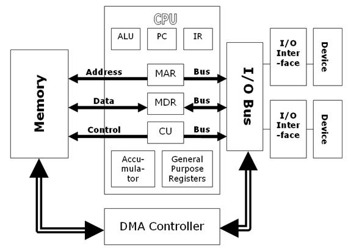

## 【译】直接内存访问(DMA)和中断处理

> 原文 [《Direct Memory Access (DMA) and Interrupt Handling》](http://www.eventhelix.com/RealtimeMantra/FaultHandling/dma_interrupt_handling.htm#.XAFmTlUzbDd)<br/>
> 译者：[Lvsi](https://github.com/Lvsi-China)

### 介绍

在本系列硬件基础知识中，我们已经研究了读写总线周期。 在本文中，我们将介绍直接内存访问（DMA）和中断处理。 了解DMA和中断处理在编写直接与IO设备交互的代码时非常有用（基于DMA的串行端口设计模式就是这种设备的一个很好的例子）。 我们将讨论以下主题：

| 话题 | 介绍 |
| --- | --- |
| 直接内存访问(DMA) | 这里描述了典型的DMA操作。涵盖了主CPU和DMA设备之间的交互。还介绍了DMA对处理器内部缓存的影响。 |
| 中断处理 | 本节描述了硬件中断的处理器处理 |
| 中断确认周期 | 许多处理器允许中断硬件设备自己识别。这加速了中断处理，因为处理器可以直接调用正确设备的中断服务程序。 |
| DMA和中断的同步要求 |软件设计人员需要记住，DMA操作可以在总线周期边界触发，而中断只能在指令边界触发。 |

### 直接内存访问(DMA)

1. 请求执行DMA的设备给处理器发出总线请求信号。 
2. 处理器完成当前总线周期后，给设备发出总线授权信号。 
3. 然后设备会发出总线授权ack信号。 
4. 处理器检测到总线授权ack信号状态的变化，并开始监听DMA的数据和地址总线。 
5. DMA设备执行从源地址到目标地址的传输。 
6. 在这些传输期间，处理器监视总线上的地址，并检查在DMA操作期间修改的任何位置是否缓存在处理器中。 如果处理器在总线上检测到已缓存的地址，则可以采取以下两种操作之一：
	- 处理器使DMA写入操作中涉及的地址的内部高速缓存条目失效
	- 检测到DMA写入时，处理器会更新内部缓存
7. DMA操作完成后，设备通过发出总线释放信号来释放总线。
8. 处理器确认总线释放并从其停止的位置恢复其总线周期。

### 中断处理

在这里，我们假设在中断处理的场景中，硬件是支持识别中断源设备的。在这种情况下，需要在软件中轮询查找所有可能的中断设备。

1. 设备在硬中断级别置位中断信号。
2. 处理器注册中断并等待完成当前指令的执行。
3. 一旦当前指令执行完成，处理器通过将当前寄存器内容保存到堆栈上来启动中断处理。
4. 然后，处理器切换到```supervisor mode```管理模式并启动中断确认周期。
5. 没有设备响应中断确认周期，因此处理器获取与中断级别对应的向量。
6. 在向量处找到的地址是中断设备的中断服务程序(interrupt service routine : ISR)的地址。
7. ISR轮询所有设备以找到引起中断的设备(中断源设备)。这是通过检查所有可能触发中断的设备上的中断状态寄存器来完成的。
8. 一旦找到设备，控制权就被转移到特定的中断设备的处理程序上。
9. 在设备特定的ISR程序执行完其作业之后，ISR执行```return from interrupt```指令。
10. 执行```return from interrupt```指令后会恢复处理器的状态。处理器恢复到```user mode```用户模式。

### 中断确认周期

在这里，我们假设在中断处理的场景中，硬件是支持识别中断源设备的。在这种情况下，可以在硬件级别识别中断的确切来源。

1. 设备在硬中断级别置位中断信号。
2. 处理器注册中断并等待完成当前指令的执行。
3. 一旦当前指令执行完成，处理器通过将当前寄存器内容保存到堆栈上来启动中断处理。
4. 然后，处理器切换到```supervisor mode```管理模式并启动中断确认周期。
5. 中断设备使用中断的向量编号响应中断确认周期。
6. 处理器使用上面获得的向量编号去获取向量。
7. 在向量处找到的地址是中断设备的中断服务程序(interrupt service routine : ISR)的地址。
8. 在ISR程序执行完其作业后，ISR执行 ```return from interrupt``` 指令。
9. 执行```return from interrupt```指令后会恢复处理器的状态。处理器恢复到```user mode```用户模式。

### DMA和中断的同步要求

很多时候，软件设计人员必须使用与中断或DMA设备共享的数据结构。这需要对共享的关键区域执行原子更新。

##### 中断同步

1. 当与ISR共享数据结构时，禁用中断以执行关键区域更新是一种很好的技术。请记住，禁用中断应仅限于更新关键区域的代码。 长时间禁用中断会增加中断延迟。 

2. 另一种选择是使用在指令边界处理中断。 执行读取或写入的单个指令可用于执行原子事务。 例如，如果你的处理器支持直接增加内存中的数据，则可以在不禁用中断的情况下自增共享信号量。

##### DMA同步

1. 使用DMA设备共享数据结构是非常棘手的。 处理器可以在总线周期边界处启动DMA操作。 这意味着可以在指令执行过程中启动新的DMA操作（请记住，指令的执行涉及多个总线周期）。

2. 执行关键区域更新的最佳机制是使用[读-修改-写 总线循环](http://www.eventhelix.com/RealtimeMantra/FaultHandling/bus_cycles.htm#Read-Modify-Write%20Bus%20Cycle)。 通过该指令，可以对关键区域进行原子更新，因为在一个特殊的总线周期中读取和写入操作是粘合在一起的。

另一种选择是禁用DMA操作。使用这些技术时应特别小心。

- 某些处理器还支持使用锁定的总线周期来禁用DMA操作。处理器可以执行锁定指令以禁用外部总线授权。 当关键区域更新完成时，解锁指令用于允许总线授权。

- 禁止DMA的另一种机制或许是暂时禁用将要执行DMA操作的设备。 例如，如果以太网控制器正在执行DMA操作，则禁用以太网控制器将会确保在进行关键区域更新时不会启动DMA操作。

### 图片




### 扩展阅读
- Quora : [What's DMA and how does it work](https://www.quora.com/What-is-DMA-and-how-does-it-work)

- [Direct Memory Access (DMA)](https://www.techopedia.com/definition/2767/direct-memory-access-dma)

- 这个网站很不错： [EventHelix.com/](http://www.eventhelix.com/)
- 这个也很好： [Higher National Computing: E-Learning Materials](https://www.sqa.org.uk/e-learning/SiteHomeCD/index.htm)

