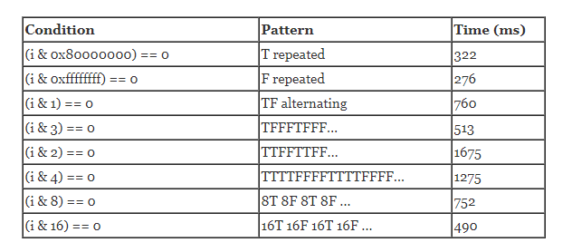
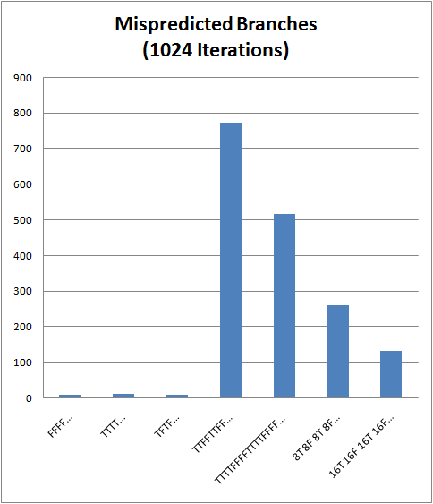
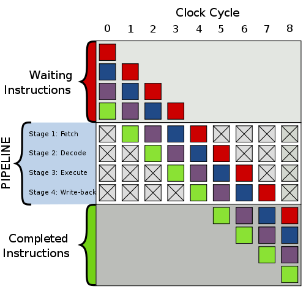

# 【译】if语句的性能：现代处理器的分支预测

> 原文 [《Fast and slow if-statements: branch prediction in modern processors》](http://igoro.com/archive/fast-and-slow-if-statements-branch-prediction-in-modern-processors/)<br/>
> 译者：[Lvsi](https://github.com/Lvsi-China)

## if语句的性能：现代处理器的分支预测

你是否知道if语句的性能取决于其是否具有可预测模式？如果条件始终为真或始终为假，则处理器中的分支预测逻辑将使用预测模式。另一方面，如果模式不可预测，则if语句将更加昂贵。在本文中，我将解释为什么今天的处理器会以这种方式运行。

让我们用不同的条件来衡量这个循环的性能：

```
for（int i = 0; i <max; i ++）if（<condition>）sum ++;
```

以下是具有不同 True-False模式 的循环的时间记录：



一个坏的 True-False模式 可以使if语句比好的模式慢六倍！当然，哪种模式好，哪种模式不好取决于编译器和特定处理器生成的指令。

## 我们来看看处理器的计数器

了解处理器如何使用其时间的一种方法是查看硬件计数器。为了帮助进行性能调整，现代处理器在执行代码时跟踪各种计数器：执行的指令数，各种类型的内存访问次数，遇到的分支数等等。要读取计数器，你需要一个工具，例如[Visual Studio 2010 Premium或Ultimate](https://docs.microsoft.com/zh-cn/visualstudio/profiling/cpu-and-windows-counters?view=vs-2015)，[AMD Code Analyst](http://developer.amd.com/cpu/CodeAnalyst/codeanalystwindows/Pages/default.aspx) 或 [Intel VTune中的分析器](https://software.intel.com/en-us/vtune) 。

为了验证我们观察到的速度缓慢是否真的是由于if语句的性能，我们可以查看 Mispredicted Branches计数器：



最坏的模式（TTFFTTFF ......）导致774个分支错误预测，而好的模式只能达到10个左右。难怪坏的情况需要最长的1.67秒，而好的模式只需要大约300毫秒！

让我们来看看“分支预测”的作用，以及它对处理器性能产生重大影响的原因。

## 分支预测的作用是什么？

为了解释分支预测是什么以及它为什么会影响性能数字，我们首先需要了解现代处理器的工作原理。要完成每条指令，CPU将经历以下（以及更多）阶段：

1. Fetch( 获取 )：读取下一条指令。

2. Decode( 解码 )：确定指令的含义。

3. Execute( 执行 )：执行指令的真正“工作”。

4. Write-back( 回写 )：将结果存储到内存中。

一个重要的优化是流水线的各个阶段可以同时处理不同的指令。因此，当一条指令被取出时，第二条指令正在被解码，第三条正在执行，第四条的结果被写回。现代处理器具有 10-31 级的流水线( 例如，Pentium 4 Prescott具有31级 )，为了获得最佳性能，保持所有级别都尽可能的繁忙是非常重要的。



分支( 即条件跳转 )给处理器流水线带来了困难。在获取分支指令之后，处理器需要获取下一条指令。但是，有两个可能的 “下一步”指令！在分支指令到达流水线末尾之前，处理器将不确定哪个指令是下一条指令。

现代处理器试图预测是否将采取跳转，而不是在分支指令完全执行之前停止流水线。然后，处理器可以获取它认为是下一条的指令。如果预测错误，则处理器将简单地丢弃流水线中的部分执行的指令。有关处理器用于收集和解释分支统计信息的一些典型技术，请参阅 Wikipedia [分支预测器实现](https://en.wikipedia.org/wiki/Branch_predictor#Implementation) 。

现代分支预测器擅长预测简单模式：全部为真，全为假，真假交替，等等。但是如果模式恰好是抛出分支预测器的东西，那么性能损失将是巨大的。值得庆幸的是，大多数分支都具有易于预测的模式，如下面高亮显示的两个示例：

```java
int SumArray（int [] array）{
     if( array == null )throw new ArgumentNullException("array");

    int sum = 0;
    
    for( int i = 0; i <array.Length ; i++ ) sum + = array [i];
    
    return sum;
}
```

第一个高亮的条件判断是验证输入，因此分支将很少采用。第二个高亮的条件判断是循环终止条件。除非处理的数组非常短，否则这也几乎总是单向的。因此，在这些情况下，在大多数情况下，处理器分支预测逻辑将有效地防止处理器流水线中的停顿。

## 更新和澄清

这篇文章已被reddit收录，并在reddit评论中得到了相当多的关注。我也会在下面的相关问题，评论和批评上回复。

首先，关于优化分支预测的评论通常是一个不好的主意：我同意。我不会在文章的任何地方争论你应该尝试编写用于优化分支预测的代码。对于绝大多数高级代码，我甚至无法想象你是如何做到这一点的。

其次，关于不同情况的执行指令是否在除常数值之外的其他方面存在差异时存在问题。他们没有 - 我看着JIT-ted组件。如果你想查看JIT-ted汇编代码或C＃源代码，请给我发一封电子邮件，然后我会用邮件回复。（我不是会在这里发布代码，因为我不想破坏这个更新。）

第三，另一个问题是 TTFF* 模式的表现令人惊讶地差。TTFF*模式 具有短周期，因此应该是分支预测算法的简单情况。

但是，问题是现代处理器不会分别跟踪每个分支指令的历史记录。相反，它们要么跟踪所有分支的全局历史，要么它们具有多个历史槽，每个槽可能由多个分支指令共享。或者，他们可以使用这些技巧的一些组合，以及其他技术。

因此，if语句中的TTFF模式在到达分支预测器时可能不是TTFF。它可能与其他分支交错（在for循环的主体中有2个分支指令），也可能以其他方式近似。但是，我并不认为自己是研究处理器的专家，如果有人读到关于不同处理器行为的权威参考（特别是我测试过的Intel Core2），请在评论中告诉我。

> 资料推荐 [Intel 官网](https://www.intel.com/content/www/us/en/homepage.html)

