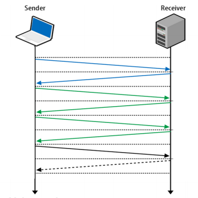
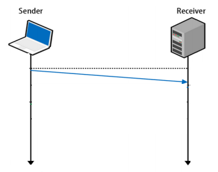
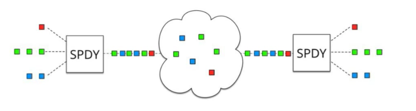
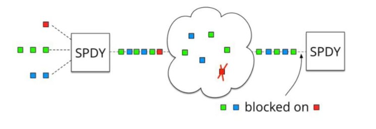
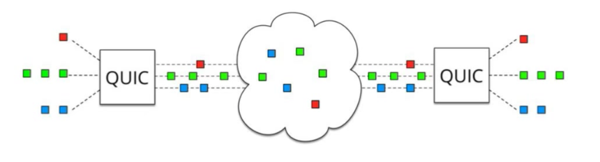
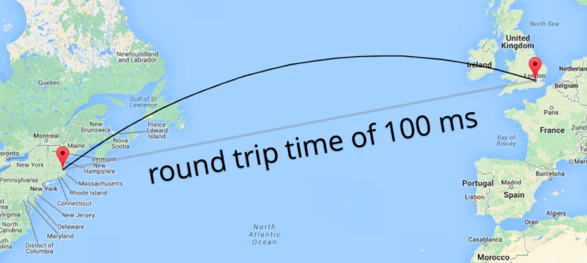
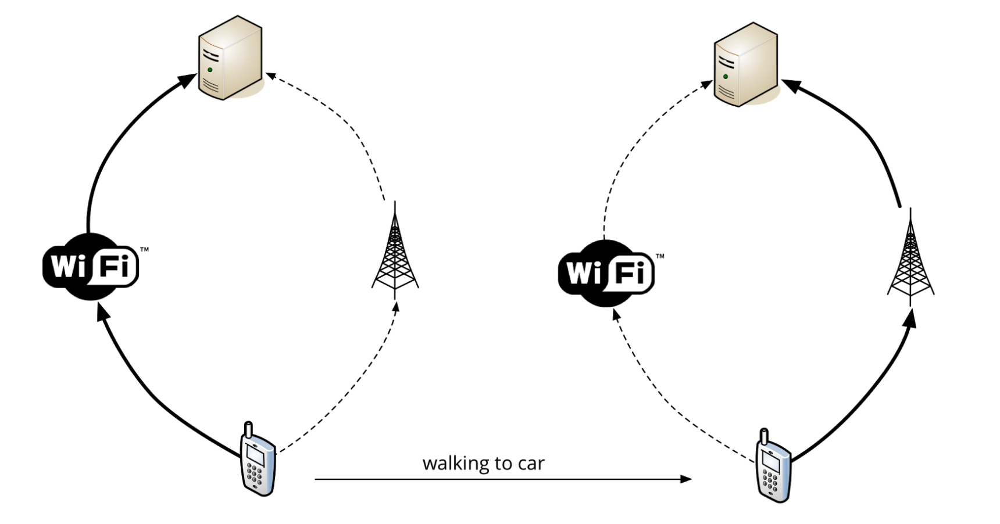
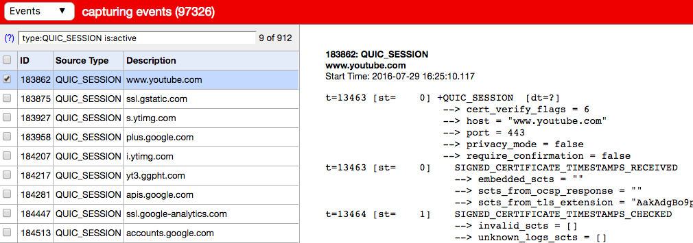
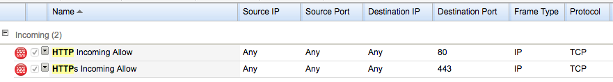
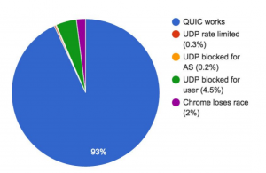

## 【译】Google的QUIC协议：将网络从TCP移动到UDP

> 原文 [Google’s QUIC protocol: moving the web from TCP to UDP](https://ma.ttias.be/googles-quic-protocol-moving-web-tcp-udp/)<br/>
> 译者：[GFeather](https://github.com/GFeather)

QUIC协议（Quick UDP Internet Connections）是一种全新的协议，用于在UDP而不是TCP上开发的Web。

有些甚至（开玩笑地）称它为[TCP / 2](https://daniel.haxx.se/blog/2016/07/27/workshop-day-two/)。

几周前，我在看到[curl & libcurl episode of the SysCast podcast](http://podcast.sysca.st/podcast/4-curl-libcurl-future-web-daniel-stenberg/)时才了解QUIC 。

现在，网络建立在TCP之上，因为它作为传输协议的可靠性。要启动TCP连接，将执行  *3次握手*。这意味着每个启动连接的额外往返*（网络数据包来回发送）*会给任何新连接带来明显的延迟。


​							*（来源：[UDP上的下一代多路传输（PDF）](https://www.nanog.org/sites/default/files//meetings/NANOG64/1051/20150603_Rogan_Quic_Next_Generation_v1.pdf)）*

如果你还需要协商TLS，以创建安全，加密的https连接，则必须来回发送更多网络数据包。



​							*（来源：[UDP上的下一代多路传输（PDF）](https://www.nanog.org/sites/default/files//meetings/NANOG64/1051/20150603_Rogan_Quic_Next_Generation_v1.pdf)）*

像[TCP Fast Open](https://en.wikipedia.org/wiki/TCP_Fast_Open)这样的创新将改善TCP的情况，但这尚未被广泛采用。

另一方面，UDP更像是一个 *启动并忽略* 协议。通过UDP发送消息，并*假定* 它到达目的地。好处是在网络上花费更少的时间来验证数据包，缺点是为了可靠，必须*在* UDP *之上*构建一些东西  来确认数据包传送。

这就是谷歌的QUIC协议的用武之地。

QUIC协议可以启动连接并协商1或2个数据包中的所有TLS（HTTPs）参数（取决于它是否是你要连接的新服务器或已知主机）。



​							*（来源：[UDP上的下一代多路传输（PDF）](https://www.nanog.org/sites/default/files//meetings/NANOG64/1051/20150603_Rogan_Quic_Next_Generation_v1.pdf)）*

### 为什么需要QUIC？

开发QUIC协议的团队正在做的事情令人难以置信。它希望将UDP协议的速度和*可能性*与TCP协议的可靠性结合起来  。

维基百科解释得相当不错。

> 由于改进TCP是Google的长期目标，QUIC旨在几乎等同于独立的TCP连接，但延迟大大减少，并且支持更好的SPDY流复用。
>
> 如果QUIC功能证明有效，那么这些功能可以迁移到更高版本的TCP和TLS（具有明显更长的部署周期）。
>
> [QUIC](https://en.wikipedia.org/wiki/QUIC)

该引言的一部分需要强调：***如果QUIC功能证明有效，那些功能可以迁移到更高版本的TCP***。

TCP协议受到高度监管。它的实现在Windows和Linux内核中，它在每个手机操作系统中......它几乎在每个低级设备中。改进TCP的工作方式将很困难，因为每个TCP实施都需要遵循。

另一方面，UDP在设计上相对简单。这是  *更快地* 实现在UDP上一个新的协议，以证明某些理论谷歌拥有约TCP的。这样，一旦他们能够确认他们关于网络拥塞，流阻塞的理论......他们就可以开始努力将QUIC的优点部分转移到TCP协议。

但改变TCP堆栈需要Linux内核和Windows，中间件，用户更新堆栈的工作......在UDP中做到同样的事情并且能够尽可能快地迭代对于制定协议的开发人员来说要困难得多，而且需要在*几个月* 实现这些理论，而不是*几年或几十年内*。

## QUIC在哪里适合？

在构成现代HTTP连接的协议层中 ，QUIC将替换TLS堆栈和HTTP / 2的部分。

QUIC协议实现了[自己的加密层](https://docs.google.com/document/d/1g5nIXAIkN_Y-7XJW5K45IblHd_L2f5LTaDUDwvZ5L6g/edit)，因此不使用现有的TLS 1.2。


它用UDP替换TCP，而QUIC是用于与远程服务器通信的较小的HTTP / 2 API。它更小的原因是因为QUIC已经处理了多路复用和连接管理。剩下的是对HTTP协议的解释。

## TCP线头阻塞

使用SPDY和[HTTP / 2](https://ma.ttias.be/?s=http2)，我们现在有一个TCP连接用于连接服务器而不是页面上每个资源的多个连接。这个TCP连接可以独立地请求和接收资源。



​							（来源：[QUIC：UDP上的下一代多路传输](https://docs.google.com/presentation/d/13LSNCCvBijabnn1S4-Bb6wRlm79gN6hnPFHByEXXptk/present?slide=id.g17a0599c4_1164)）*

现在一切都依赖于单个TCP连接，引入了一个缺点：**线头阻塞**。

在TCP报文需要~~到达~~正确的顺序进行处理。如果数据包在往/返服务器的路上丢失，则需要重新传输。TCP连接需要等待（或“阻塞”）该TCP数据包才能继续解析其他数据包，因为**TCP数据包的处理顺序很重要。**



*（来源：[QUIC：UDP上的下一代多路传输](https://docs.google.com/presentation/d/13LSNCCvBijabnn1S4-Bb6wRlm79gN6hnPFHByEXXptk/present?slide=id.g17a0599c4_1164)）*

在QUIC中，通过不再使用TCP来解决这个问题。

**UDP不依赖于接收数据包的顺序。**虽然数据包在传输过程中仍然可能丢失，但它们只会影响单个资源（如：单个CSS / JS文件），而不会阻止整个连接。



*（来源：[QUIC：UDP上的下一代多路传输](https://docs.google.com/presentation/d/13LSNCCvBijabnn1S4-Bb6wRlm79gN6hnPFHByEXXptk/present?slide=id.g17a0599c4_1164)）*

QUIC基本上是在非阻塞传输协议之上组合SPDY和HTTP2的最佳部分（多路复用）。

## 为什么更少的数据包如此重要

如果你足够幸运能够快速上网，那么你和10-50ms之间的远程服务器之间可能存在延迟。你通过网络发送的每个数据包都将花费该时间来接收。

对于低于50毫秒的延迟，可能不会立即显现出来。

当你与另一个大洲的服务器 或 通过手机运营商使用Edge，3G / 4G / LTE来交互时，这一点尤为明显。要从美国的欧洲到达服务器，你必须穿越大西洋。由于需要行进的距离，你会获得**+ 100ms**或更高的延迟惩罚。



*（来源：[QUIC：UDP上的下一代多路传输](https://docs.google.com/presentation/d/13LSNCCvBijabnn1S4-Bb6wRlm79gN6hnPFHByEXXptk/present?slide=id.g17a0599c4_1164)）*

移动网络具有相同的延迟：在慢速连接上移动电话和远程服务器之间的延迟不会太短，仅仅是因为必须要经过无线电频率和中间网络。在4G / LTE情况下，则更容易达到50ms的延迟。

在移动设备和大型远程网络上，发送/接收4个数据包（TCP + TLS）和1个数据包（QUIC）之间的差异可以为该初始连接节省高达300毫秒的时间。

## 前向纠错：防止失败

QUIC的一个很好的功能是FEC或**前向纠错**。发送的每个数据包还包括其他数据包的足够数据，以便可以重建丢失的数据包而无需重新传输。

**这实际上是网络级别的RAID 5。**

因此，需要进行权衡：每个UDP数据包包含的*负载* 超出了严格要求，因为它可以解决丢失数据包的*可能性*，这种数据包可以更容易地以这种方式重新创建。

当前比率似乎约为10个数据包。因此，对于每发送10个UDP数据包，有足够的数据来重建丢失的数据包。10％的开销，如果你愿意的话。

将前向纠错视为可以发送的*“每UDP数据包数据”* 的牺牲，但增益不必重新发送丢失的数据包，这将花费更长的时间*（收件人必须确认丢失的数据包，请求它再次等待回应）*。

## 会话恢复和并行下载

切换到UDP的另一个令人兴奋的机会是你不再依赖于连接的*源 IP*。

在TCP中，你需要4个参数来组成连接。所谓的**四胞胎**。

要启动新的TCP连接，你需要源IP，源端口，目标IP和目标端口。在Linux服务器上，你可以看到使用的四元组`netstat`。

```bash
$ netstat -anlp | grep'：443' 
... 
tcp6 0 0 2a03：a800：a1：1952 :: f：443 2604：a580：2：1 :: 7：57940 TIME_WAIT  - 
tcp 0 0 31.193.180.217:443 81.82.98.95:59355 TIME_WAIT  - 
......
```

如果任何参数（源IP /端口或目标IP /端口）发生更改，则需要进行新的TCP连接。

这就是为什么在移动设备上保持稳定连接非常困难，因为你可能会在WiFi和3G / LTE之间不断切换。



*（来源：[QUIC：UDP上的下一代多路传输](https://docs.google.com/presentation/d/13LSNCCvBijabnn1S4-Bb6wRlm79gN6hnPFHByEXXptk/present?slide=id.g17a0599c4_1164)）*

使用QUIC，因为它现在使用UDP，所以没有四元组。

QUIC为称为**Connection UUID的**唯一连接实现了自己的标识符。从WiFi到LTE仍然可以保持你的连接UUID，因此无需重新协商连接或TLS。你之前的连接仍然有效。

这与[Mosh Shell的](https://mosh.mit.edu/)工作方式相同，通过UDP保持SSH连接活动，以获得更好的漫游和移动体验。

这也为使用多个来源获取内容打开了大门。如果可以通过WiFi *和* 蜂窝连接共享连接UUID ，理论上可以使用两种媒体来下载内容。你可以使用你拥有的每个可用界面并行地有效地流式传输或下载内容。

虽然仍然是理论上的，但UDP允许这种创新。

## QUIC协议正在实施中

自2014年以来，Chrome浏览器一直支持QUIC（实验性）。如果你想要测试QUIC，[可以在Chrome中启用协议](https://ma.ttias.be/enable-quic-protocol-google-chrome/)。实际上，你只能针对Google服务测试QUIC协议。

谷歌拥有的最大好处是拥有*浏览器* 和*服务器* 市场份额的组合。通过在客户端（Chrome）和服务器（YouTube，Google.com等Google服务）上启用QUIC，他们可以*在生产中*对新协议*进行*大规模测试。

有一个方便的Chrome插件，可以在浏览器中将HTTP / 2和QUIC协议显示为一个图标：[HTTP / 2和SPDY指示器](https://chrome.google.com/webstore/detail/http2-and-spdy-indicator/mpbpobfflnpcgagjijhmgnchggcjblin?hl=en)。

你可以通过立即打开`chrome://net-internals/#quic`选项卡来查看QUIC的使用方式（你还会注意到前面提到的**连接UUID**）。


如果你对低级别的详细信息感兴趣，你甚至可以查看所有实时连接并获取每个数据包的单个捕获：`chrome://net-internals/#events&q=type:QUIC_SESSION%20is:active`。



与你如何查看SDPY或HTTP / 2连接的内部结构类似。

## 不会有人想到防火墙吗？

如果你是一个系统管理员或网络工程师，当我提到QUIC是UDP而不是TCP时，你可能会在开头时耸耸肩。你也可能有充分的理由。

例如，当我们在[Nucleus Hosting](https://www.nucleus.be/en/)为网络服务器配置防火墙时，那些防火墙规则就像这样。



请特别注意**协议列：TCP**。

我们的防火墙与数千个其他系统管理员部署的防火墙没有太大区别。此时，网络服务器没有理由允许除了`80/TCP`或`443/TCP`之外的任何内容。仅限TCP。没有UDP。

好吧，如果我们想要允许QUIC协议，我们也需要允许`443/UDP`。

对于服务器，这意味着打开传入`443/UDP`Web服务器。对于客户来说，这意味着允许传出`443/UDP`到互联网。

在大型企业中，我可以看到这是一个问题。让它通过安全性以允许UDP在正常的TCP端口上听起来很*可疑*。

我实际上认为这是连接方面的一个主要问题，但是谷歌已经完成了实验 - 结果[并非如此](https://www.ietf.org/proceedings/96/slides/slides-96-quic-3.pdf)。

*（来源：[QUIC部署体验@Google](https://www.ietf.org/proceedings/96/slides/slides-96-quic-3.pdf)）*

这些数字是在瑞典最近的一次HTTP研讨会上提供的。几个关键指针;

- 由于现在仅在Google服务上支持QUIC，因此服务器端防火墙可能正常。
- 这些数字仅限客户端：它们显示允许多少客户端通过端口443执行UDP。
- 出于合规性原因，可以在Chrome中停用QUIC。我敢打赌，有很多企业已禁用QUIC，因此甚至没有尝试过这些连接。

由于QUIC也支持TLS，我们只需要担心端口443上的UDP。还不太可能很快在UDP的80端口上实现。

仅加密的做法的优点是Deep Packet Inspection中间件（又名：入侵防御系统）无法解密TLS流量并修改协议，他们会在防火墙上看到二进制数据并希望 - 让它通过吧。

## 运行QUIC服务器端

现在，唯一可以让你获得QUIC的网络服务器就是0.9版以后的[Caddy](https://github.com/mholt/caddy/wiki/QUIC)。

客户端和服务器端支持都被认为是实验性的，因此你可以自行运行它。

由于在客户端默认情况下没有人启用QUIC支持，因此你可能仍然可以安全地运行它并在你自己的浏览器中启用QUIC。（**更新：自Chrome 52以来，默认情况下每个人都启用了QUIC，甚至是非白名单网域**）

为了帮助调试QUIC，我希望curl能尽快实现它，[这一点十分兴趣](https://daniel.haxx.se/blog/2016/07/20/curl-wants-to-quic/)。

## QUIC的性能优势

在[2015年的博客中，](http://blog.chromium.org/2015/04/a-quic-update-on-googles-experimental.html)谷歌分享了QUIC实施的几个结果。

> 因此，在网络状况不佳的情况下，QUIC比TCP更具优势，在最长1％的连接中缩短Google搜索页面加载时间。
>
> 对于像YouTube这样的视频服务，这些好处更加明显。用户在使用QUIC观看视频时报告的重建次数减少了30％。
> [谷歌实验性交通的QUIC更新（2015）](http://blog.chromium.org/2015/04/a-quic-update-on-googles-experimental.html)

YouTube统计数据特别有趣。如果可以进行这些改进，我们会看到像Vimeo或“成人流媒体服务”这样的视频流服务的快速采用。

## 结论

我发现QUIC协议真的很吸引人！

大量工程已经完成，事实上它已经在最大的网站上运行，这让我大吃一惊。

我迫不及待地想看到QUIC规范成为最终版并在其他浏览器和网络服务器中实现！

## 更新：QUIC设计师Jim Roskind的评论

吉姆罗斯金德非常友好地对这个值得强调的博客发表评论（[见下文](https://ma.ttias.be/googles-quic-protocol-moving-web-tcp-udp/#comment-36462)）。

> 花了数年时间在QUIC的研究，设计和部署上，我可以增加一些见解。当我们尝试使用QUIC（UDP）可行性时（在花时间详细设计和架构之前），你对UDP端口被阻止的评论正是我的猜想。我的猜想是，我们只能获得93％可达性的原因是因为企业客户通常阻止UDP（除了DNS所需的以外）。
>
> 如果你回忆起历史，企业客户通常会阻止TCP端口80“以防止员工浪费时间冲浪”，那么你就知道过度保守的安全确实会发生（并且可用性会带来变化！）。众所周知，允许UDP：443出口将提供更好的用户体验（即，员工可以更快地完成工作，并减少带宽浪费），那么我预计可用性将再次胜过安全......而且UDP：443端口将在大多数企业方案中打开。
>
> ... ...确实......使用“TCP / 2”字样的标题可能会使IMO成为目标。我期望QUIC拥塞避免的演进速度将使QUIC能够比TCP更快地跟踪互联网的进展（新的硬件部署？新的蜂窝塔协议等等）。
>
> 因此，我预计QUIC将在很大程度上取代TCP，即使QUIC提供了任何/所有技术建议以便纳入TCP。TCP通常在内核中实现，这使得进化步骤需要5到15年（包括市场渗透！更不用说与中间盒的战斗），而QUIC可以在数周或数月内发展。
>
> [- 吉姆（QUIC建筑师）](https://ma.ttias.be/googles-quic-protocol-moving-web-tcp-udp/#comment-36462)

感谢Jim的反馈，看到QUIC协议的原作者回应真是太棒了！

## 进一步阅读

如果你正在寻找更多信息，请查看以下资源：

- [QUIC：UDP上的下一代多路传输](https://www.nanog.org/sites/default/files//meetings/NANOG64/1051/20150603_Rogan_Quic_Next_Generation_v1.pdf)
- [QUIC部署体验@ Google](https://www.ietf.org/proceedings/96/slides/slides-96-quic-3.pdf)
- [QUIC的设计和理由](https://docs.google.com/document/d/1RNHkx_VvKWyWg6Lr8SZ-saqsQx7rFV-ev2jRFUoVD34/mobilebasic)
- [IETF草案：QUIC：基于UDP的HTTP / 2安全可靠传输](https://tools.ietf.org/html/draft-tsvwg-quic-protocol-00)

非常感谢Google领导这里的努力！