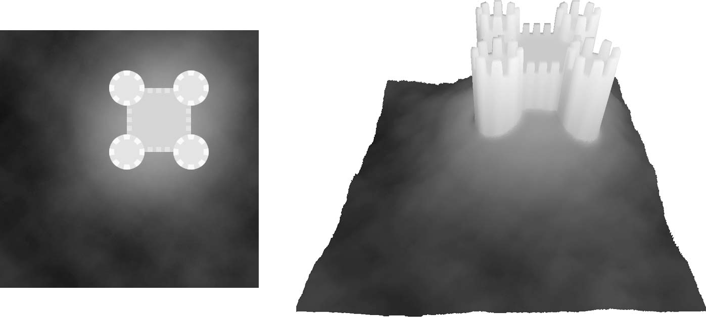
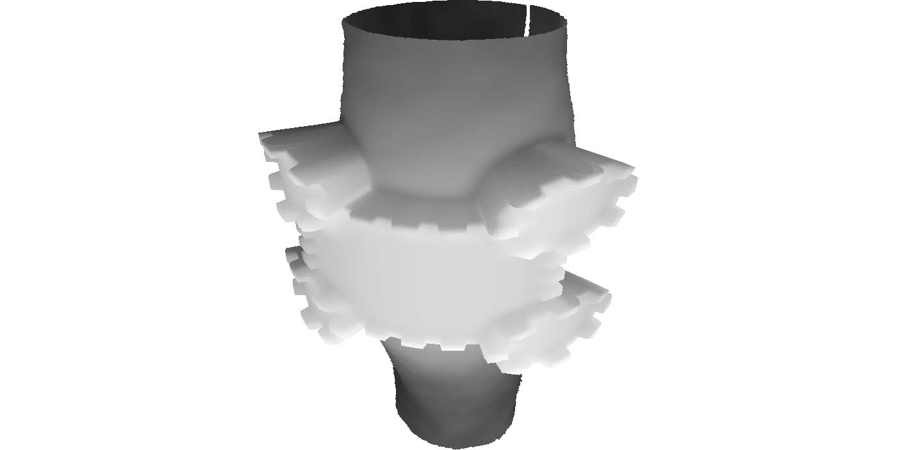
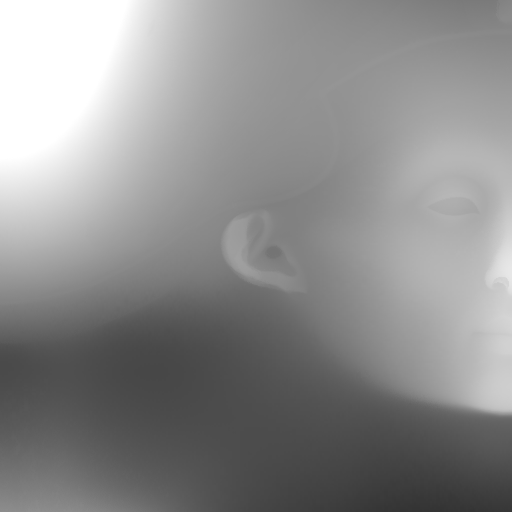
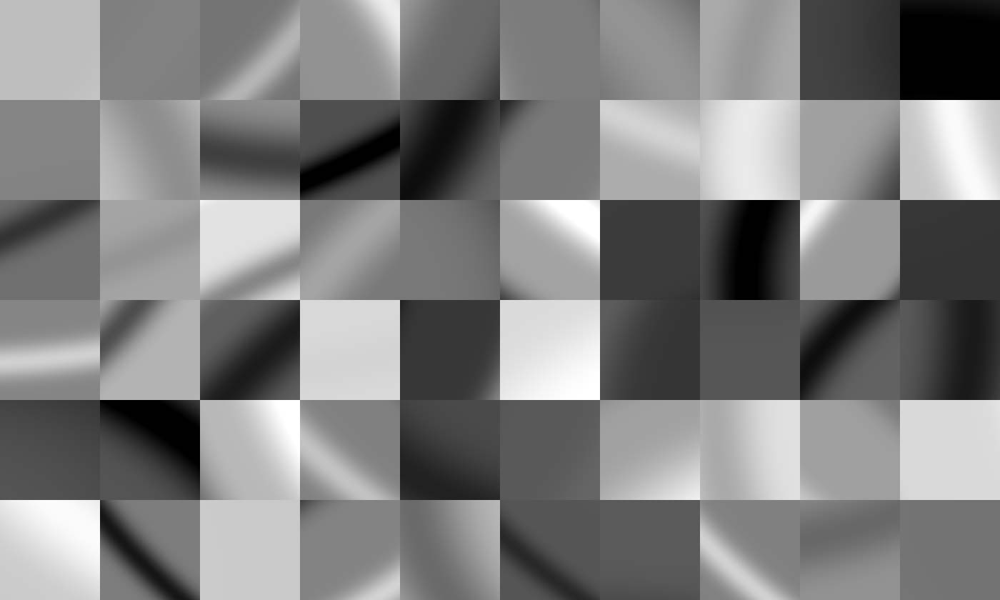
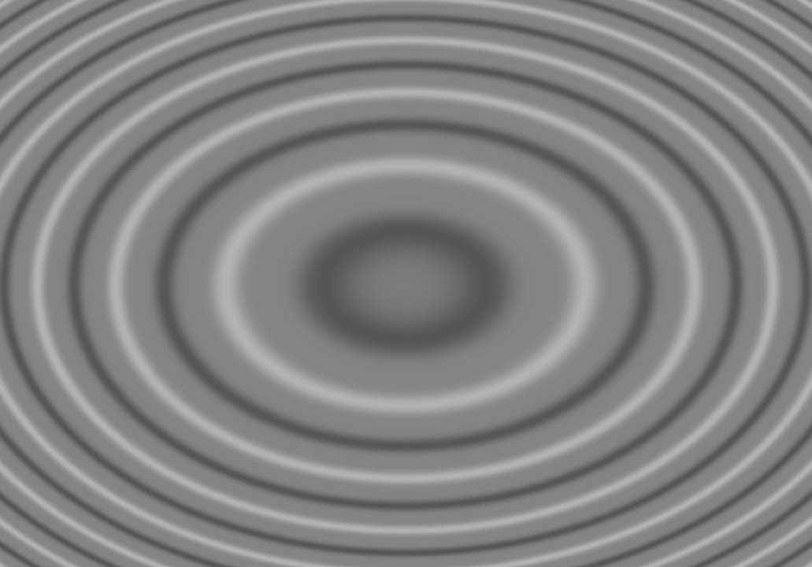
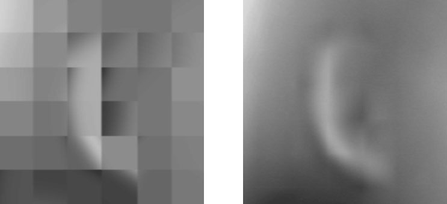
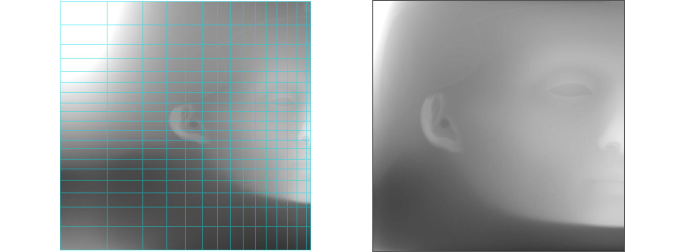
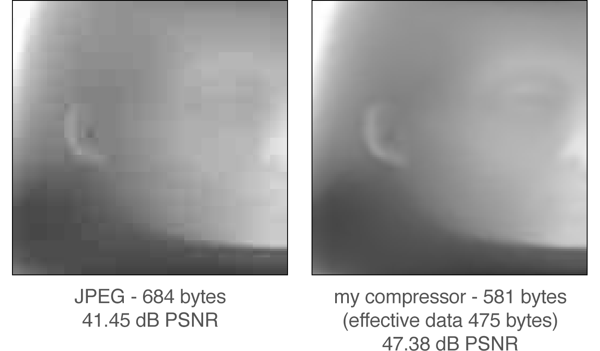

## 【译】将Nefertiti变为1kb

> 原文 [The Making of Nefertiti 1kb](http://romancortes.com/v2/nefertiti-1kb.html) 
> 译者：[GFeather](https://github.com/GFeather)

大约10年前 - 哇，时间过得真快！ - 我与一个天才，我的朋友西班牙人[Íñigo Quílez](http://www.iquilezles.org/)谈论了在4kb大小的demo中包含3d模型是极端困难的。

在思考要提交到js1k比赛的2018年版demo时，我回想起与Íñigo的这次谈话。知道在4kb的限制下非常困难，我的第一反应是认为只用1kb是不可能的。不久我发现或许在一个低水平细节的模型上它是可以实现的，不过足够制作出一个与人头近似的有趣形状。所以我开始尝试。*Challenge accepted*.

然后我实现了第一步 – 近似人头的东西  –  我继续使用我的所有学识提高模型 质量知道提交js1k的模型。我会在这篇博文中描述开发过程。

#### 渲染方法

这个demo包含3个主要部分：渲染方法，数据压缩和数据源。渲染方法是一个平行投影的柱面高度图。

高度图是一种灰度图像，其中每个像素的强度表示三维曲面中的高度：

如果你把高度图应用到一个圆柱体上，那么你就得到了圆柱形的高度图:

最终，我们得到一个平行投影而不是一个透视图，因此它变成了一个非常简单的渲染方法，并且可以旋转对象所以可能是一个更简单的3d渲染方法。

这是一个很古老的方法，1996年我在 [Despair by Iguana](https://youtu.be/L_lD7iqG8nA?t=1m41s) 第一次看到它，并且我认为这是第一个实现，但是当我联系作者他给了我几个demo，其中包括： [Parallax by Zif](https://youtu.be/3aypDPGAyVE?t=1m15s), [Neural Assault by Rage](https://youtu.be/yVSRWsBM7aY?t=3m10s) 和 [Hardwired by The Silents & Crionics](https://youtu.be/EXmYZXBjbFc?t=3m23s) – 感谢[Jare](https://twitter.com/theJare)提供的内容。

#### Nefertiti 半身像

得到圆柱形高度图之后，我需要一个好的3d模型。圆柱形高度图在其可以再现的形状类型方面受到限制，所以一个好的模型应该是一个适配它的模型。

[The Nefertiti bust](https://en.wikipedia.org/wiki/Nefertiti_Bust)不仅完美适配圆柱形高度图，并且有很多很棒的属性非常适合这个demo。它非常著名并且很好识别，是历史上最棒的艺术品之一，它还是完全对称的 – 这允许我只存储一半数据然后镜像复制出另一半，这非常优雅，并且易于[扫描和使用](http://nefertitihack.alloversky.com/).

通过扫描的数据，我调整旋转以寻找最大的对称性，然后我生成了这个高度图，它混合了半身像左右两侧的部分：

#### 数据压缩

由于高度图是图像，因此数据解压缩器是 [有损](https://en.wikipedia.org/wiki/Lossy_compression)图像解压缩器。

最有效的有损压缩方法是使用[熵编码](https://en.wikipedia.org/wiki/Entropy_encoding)。

不幸的是，根据我的测试，由于js比赛的限制使用熵编码是没有意义的。基于这些，在比赛限制下和我测试出来有效的选项有这些：

- 简单的纹理压缩方法 – S3TC, PVRTC – 不能提供足够的压缩率
- ASTC解码器 – 纹理压缩的最新技术 – 占用太多空间
- 基于矢量的方法提供了合理/良好的结果，但需要捕获相当多的面部和头部特征以使Nefertiti可识别。经过几次尝试不同类型的曲线和渐变后，我没有得到任何出色的结果
- 对于具有如此多软区域的图像，多尺度方法感觉很自然，但是增加的代码大小和缺少熵编码使它们看起来不合适
- 像[jscrush](http://www.iteral.com/jscrush/)这样适用于js 1k的无损压缩器不足以替代熵编码

这里有一个其他选项，多年前我在这个领域进行实验，试图在最小的空间内为图像拟合解压缩器和数据，并且具有非常高的质量。我想出了一个基于正弦圆波的块式压缩机， [我甚至提交了一个从未提交过的js 1k条目的尝试](http://www.romancortes.com/ficheros/gioconda_js1k.php)

来自正弦圆波的想法来自于，对生成包含多种类型的梯度，角度，曲线和具有固定大小数据的折叠的块，没有任何量化和熵编码的方法的思考。

这些是从中截取石块的波浪:

因为它不是一个适当的转换，所以它只在有限大小的上下文（如JS1K）中有用，对于任何其他用途来说，它都是无用的，但是，它对JS1K非常有用。

#### 分解块

对于图像，阻塞伪影并不太糟糕，它们甚至可以提高感知的清晰度。对于高度图来说，它们是非常糟糕的，你可以在3D中清楚地看到它们生成的网格模式。如果图像中有一张脸的话结果是非常糟糕的。所以我必须实现一个去块过滤器。

我所实现的过滤器是作为双线性插值的等价物应用到所有块上的。

#### 非常规网格

我想集中面部的细节，为此我将网格间隔切换为非规则的，如图所示，将细节从周围区域移动到面部。右边的图像是我结束压缩的图像：

#### 压缩高度图

在添加去块之前，压缩过程很简单：为了获得全局最佳解决方案，一个块一个块的强制执行只需要几秒钟。

但在添加解块后，事物变得非常指数化。每个街区都会影响周围环境块中的更改可以传播并导致其中一个邻居发生更改，依此类推，从而产生一波变化。那么，如何计算呢？

为了达到优化的目的，我最喜欢和首选的算法是[梯度上升](https://en.wikipedia.org/wiki/Hill_climbing)。在某些情况下效果很好，在这种情况下我遇到了一些问题。它很快达到了局部最小值，解决方案也很糟糕。其中一个问题甚至导致了视觉上的问题：一个坏的块被一个相邻的块修复了，因此在这个过程中有时会留下一个问题，并被联锁。

为了找到解决这些问题的方法，我有一个**神奇的想法**。我试着在谷歌中搜索它是否已经被发现或没有结果，但我不能确定我是第一个。如果有专家读过这个-有人读过这个吗？–如果知道，请联系我！不管怎样，这个想法是：

**找到2个或更多的评估函数，它们对您的问题具有全局最小值。在爬山的每一步中随机选择其中一个功能。**

我使用的评价函数有均方误差、均绝对误差等。使用此方法可以消除所有问题。这是迄今为止我在梯度上升中使用过的最好的策略。使用它增加了3dB的PSNR。

#### 优化高度图的解压器

以下代码是生成块的代码：

**49** + p % .787 * **139** * Math.sin(p - ((p % 67 - 33 - i * **2**) ** 2 + (p % 53 - 26 - j * **3**) ** 2) / **132**) ** (**3** + p % **6** * 2) + p % .909 *  198

红色和粗体数字是解压器的可配置参数。通过调整这些参数，您可以生成适合目标图像更好或更差的块。我自动搜索良好的参数，因此减压器适应高度图。

#### 与JPEG比较

作为参考与JPEG的比较：

公平地说，我应该提到，这比我的压缩器有多好更能说明JPEG在高压缩率下有多糟糕。我通过压缩高度图来做到这一点，高度图的大小调整为128x128。为了帮助JPEG，我尝试将其大小调整到64x64，PSNR增加了，但即便如此，它还是比我的压缩器差很多。

我还与WebP进行了比较。 WebP明显优于JPEG，但还是比我的压缩器差。

浏览器中的另一个选项是H.264。我曾想过使用H.264中存储的单帧视频，但我无法生成一个足够小的视频文件来容纳1KB。这可能是可能的，但我对视频压缩的了解有限。