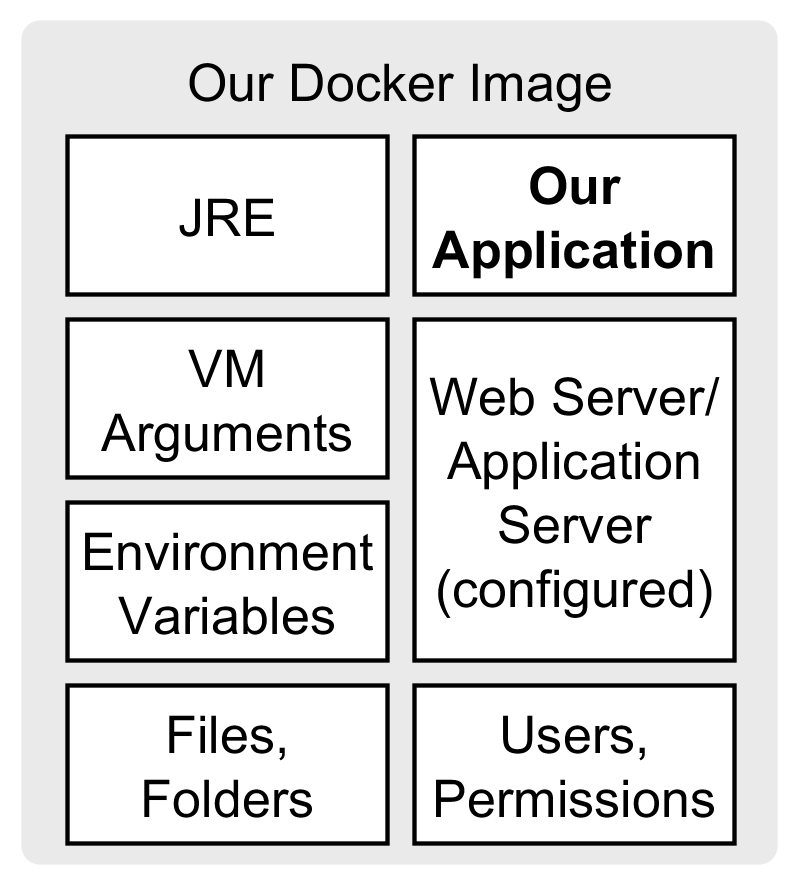
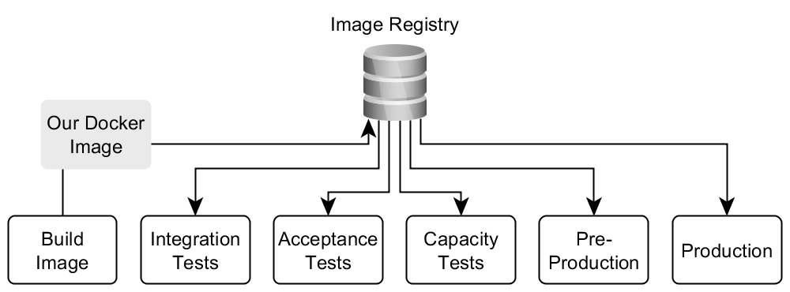

# 讨论Docker优缺点

> 原文 [Discussing Docker. Pros and Cons.](https://phauer.com/2015/discussing-docker-pros-and-cons/) 
> 译者：[Lvsi-China](https://github.com/Lvsi-China)

Docker使我们能够轻松地为我们的应用程序创建可重现的环境。我们自动化环境设置并消除手动容易出错的任务。这样我们可以降低部署过程的风险和可靠性。但也有挑战和领域，Docker的使用可能很困难。这篇文章讨论了Docker的几个优点，并指出了一些缺点。

## 好处

### 开发团队的优势

- 完全控制应用程序的执行环境。这包括必要的基础结构，如JRE，应用程序服务器，VM参数以及应用程序运行所需的其他环境变量。开发团队可以轻松，独立地更改基础架构，因为他们无需等待运营团队更改环境。
 Docker镜像包含我们的应用程序需要运行的所有内容（除了数据库等外部资源）。
Docker镜像包含我们的应用程序需要运行的所有内容（除了数据库等外部资源）。

- 降低风险。测试针对最终将在生产服务器上运行的相同映像运行。这增加了测试的可靠性。此外，发布变得不那么可怕，因为我们只是在生产服务器上运行与测试或构建管道的其他阶段（例如，预生产系统，验收测试，容量测试等）相同的映像。
 在Continuous Delivery Pipeline的所有阶段使用Docker镜像
构建Docker镜像后，我们在（连续）传送管道的所有阶段使用图像。这增加了我们交付的可靠性。

### 运营团队的优势

- 减少维护应用程序环境的工作量。环境的创建是自动化的。因此，需要较少的手动操作。这降低了风险并提高了可靠性。
- 在多台服务器上手动维护一致的环境容易出错，可能是一场噩梦。使用Docker，可以轻松创建多个环境实例，因为我们只需要在服务器上执行映像。通过这种方式，可以轻松地将更多节点添加到群集并进行水平扩展。
- 轻松更新现有应用程序和环境。使用传统方法设置环境（如安装脚本）在已有环境时遇到麻烦。考虑脚本中的更新路径可能是一项非常复杂的任务（例如，检查文件的存在并清理未使用的文件）。使用Docker，我们不必考虑现有环境（数据库除外）。我们只是停止正在运行的容器并启动新的更新容器。这简化了设置，因为我们始终以空的环境开始。

### 基础设施代码
当使用Docker（以及Chef  或Puppet等其他工具）来设置我们的环境时，我们将受益于“基础架构即代码”方法。基础架构不再是手动创建的，而是自动化过程的结果。我们明确地描述了我们的基 对于Docker，Dockerfile是我们描述环境的文档。这带来了以下好处：

- 我们可以将Dockerfile置于版本控制之下并跟踪对环境所做的更改。这样，我们始终知道哪个应用程序版本属于哪个版本的环境。
- 我们获得了可靠的基础设施文档。我们始终知道我们的应用程序需要运行什么以及环境中当前安装的是什么。
- 此外，文档始终是最新的，因为我们需要更改它以改变环境。
- 因此，设置新环境很容易，因为我们知道需要安装什么。

### 与其他自动化工具相比

使用Chef或Puppet等工具，您还可以实现Docker的许多优势（例如可重现的环境，基础架构文档和新节点的轻松设置）。但是，当我们使用虚拟化方法（如Docker）时，我们可以获得以下优势：

- 当我们想要实现持续交付时，我们需要为交付管道的每个阶段（提交阶段，验收测试，容量测试，预生产和生产）设置多个环境实例。为此目的使用物理机器是不切实际的。
- 应用程序的安装和必要的环境变得简单，因为我们总是从空VM开始（实际上Docker不会启动真正的VM，见下文）。可以完全删除旧VM，并设置新VM。

### 轻量级虚拟化
出于这个原因，Chef或Puppet通常与虚拟化结合使用：启动虚拟机，使用Chef或Puppet在VM中设置环境。使用Docker而不是真正的VM时，我们有以下好处：

- 轻量级虚拟化。启动Docker容器比启动VM要快得多，因为不必启动客户机操作系统。这减少了开销。几个容器共享主机操作系统的内核，但拥有自己的文件系统，用户，网络和进程。从主机操作系统的角度来看，当我们运行Docker容器时，我们就开始另一个进程。这显着加速了容器的启动，同时仍然提供了容器的良好隔离。

## 缺点和挑战
在赞美Docker之后（太多了？），让我们考虑使用Docker时的缺点和挑战：

* 由于附加层而增加了复杂性。这不仅影响部署，还影响开发和构建。
* 此外，管理大量容器具有挑战性 - 特别是在集群容器方面。像Google Kubernetes  和  Apache Mesos这样的工具 可以在这里提供帮助。
* 容器共享相同的内核，因此与真实的VM相比不那么孤立。内核中的错误会影响每个容器。
* Docker基于Linux Containers（LXC），这是一种Linux技术。因此，我们无法在其他系统上运行Docker，而我们的容器始终是Linux系统。但是Boot2Docker  可以通过VirtualBox在Windows和Mac OS X上使用Docker。Docker客户端在主机操作系统上运行，并与VirtualBox内的Docker守护程序通信。不幸的是，这不太舒服，使得日常使用笨拙，比本地运行Docker更复杂。
* 引入Docker可能是一项艰巨而耗时的任务。我们必须评估是否值得付出努力并增加复杂性。在我过去的一个项目中，管理层拒绝了Docker的论点，即3个节点（生产，预生产和实验）不足以证明这一努力......但是，如果你有一个节点集群（当水平扩展时）或使用持续交付需要一种方法来重现环境，Docker在这方面非常出色。此外，持续交付可缩短产品上市时间（新功能可以更快地投入生产，因为部署和环境设置是自动化的），可用于说服管理层。
* 我还获得了在严格监管的域名（如银行业）中对Docker也有所保留的经验：
 - 要运行容器，您需要root权限。对于某些公司而言，这可能是一个问题，在这些公司中，应该在生产服务器上运行和更新应用程序的同事不能拥有root权限。
 - 目前还不清楚Docker的使用是否符合必须满足的某些安全标准（如PCI）。
 - 在一些公司中，存在一个值得怀疑的规则，即只有来自官方/可信来源的软件才能安装在机器上。例如，Docker不包含在Red Hat Enterprise Linux 6中，因此需要从docker.com安装，这是一个“不受信任的来源”。

## 相关文章
[使用Maven构建Docker镜像](https://phauer.com/2015/building-dropwizard-microservice-docker-maven/)

## 参考
[推荐博客：Philipp Hauer's Blog](https://phauer.com/)

