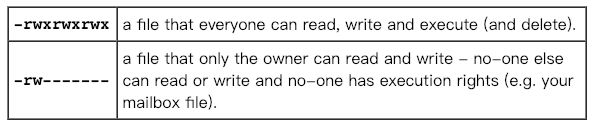
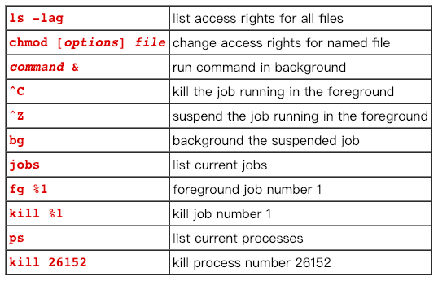

# UNIX教程五

> 原文 [UNIX Tutorial Five](http://www.chm.bris.ac.uk/compres/unix/unix5.html)<br/>
> 译者：[Lvsi-China](https://github.com/Lvsi-China)

## 5.1文件系统安全性（访问权限）

在unixstuff目录中，键入

```
％ls -l（l用于长列表！）
```

您将看到您现在获得了有关目录内容的大量详细信息，类似于下面的示例。


每个文件（和目录）都具有关联的访问权限，可以通过键入ls -l找到。此外，ls -lg提供有关哪个组拥有该文件的其他信息（以下示例中为beng95）：

```
-rwxrw-r-- 1 ee51ab beng95 2450 9月29日11:52 file1
```

在左侧列中是一个10符号字符串，由符号d，r，w，x， - 组成，偶尔还有s或S.如果存在d，它将位于字符串的左端，并指示目录：否则 - 将是字符串的起始符号。

其余9个符号表示权限或访问权限，并被视为三组3。

* 左侧的3组为拥有该文件（或目录）的用户提供文件权限（上例中为ee51ab）; 
* 中间组为文件（或目录）所属的人群提供权限（上例中为eebeng95）;
* 最右边的组为所有其他人提供权限。

符号r，w等具有略微不同的含义，这取决于它们是指简单文件还是指向目录。

### 对文件的访问权限。

* r（或 - ）表示读取权限（或其他），即是否存在读取和复制文件的权限 
* w（或 - ）表示写入权限（或其他），即更改文件的权限（或其他） 
* x（或 - ）表示执行权限（或其他），即适当时执行文件的权限

###　目录的访问权限。

* r允许用户列出目录中的文件;
* w表示用户可以从目录中删除文件或将文件移入其中;
* x表示访问目录中文件的权限。这意味着如果您对单个文件具有读取权限，则可以读取目录中的文件。

因此，为了读取文件，您必须对包含该文件的目录具有执行权限，因此必须在包含该目录的任何目录作为子目录，依此类推，在树上。

### 一些例子



## 5.2更改访问权限

### chmod（更改文件模式）

只有文件的所有者才能使用chmod来更改文件的权限。chmod的选项如下


例如，要删除 组和其他人的文件biglist上的读写和执行权限，请键入
```
$ chmod go-rwx biglist
```
这将使其他权限不受影响。

为所有人提供文件biglist的读写权限，

```bash
$ chmod a + rw biglist
```

### 练习 5a

尝试更改文件science.txt和目录备份的访问权限

使用 ```ls -l``` 检查权限是否已更改。

## 5.3 流程和工作

进程是由唯一PID（进程标识符）标识的执行程序。要查看有关流程的信息及其关联的PID和状态，请键入

```bash
$ ps
```

进程可以在前台，后台或暂停。通常，在当前进程执行完毕之前，shell不会返回UNIX提示符。

某些过程需要很长时间才能运行并占用终端。对长进程进行后台处理会导致立即返回UNIX提示，并且可以在原始进程继续执行时执行其他任务。

### 运行后台进程
要对进程进行后台处理，请在命令行末尾键入＆。例如，命令sleep在继续之前等待给定的秒数。类型

```bash
$ sleep 10
```

这将在返回命令提示符％之前等待10秒。在返回命令提示符之前，除等待之外什么都不做。

要在后台运行睡眠，请键入

```bash
$ sleep 10 ＆
```

```text
[1] 6259
```
在与在后台运行的任务并返回提示直线距离，让你运行其他程序，同时等待一个完成。

上例中的第一行是用户输入的; 机器返回下一行，表示作业号和PID。将向用户通知方括号中的作业编号（编号为1）以及PID，并在后台处理完成时通知用户。背景对于需要很长时间才能完成的工作非常有用。

背景当前前景过程
在提示符下键入

```bash
$ sleep 1000
```
您可以通过键入 ^Z 暂停在前台运行的进程，按住[ Ctrl ]键并键入[ z ]。然后将它放在后台，输入

```bash
$ bg
```
> 注意：请勿使用需要用户交互的后台程序，例如vi

## 5.4列出暂停和后台进程

当进程正在运行，后台或挂起时，它将与作业号一起输入到列表中。要检查此列表，请键入

```bash
$ jobs
```

可以是作业列表的示例

```text
[1] Suspended sleep 100
[2] Running netscape
[3] Running nedit
```

要重新启动（前台）挂起的进程，请键入

```bash
$ fg ％jobnumber
```
例如，要重新启动sleep 1000，请键入

```bash
$ fg ％1
```

键入没有作业号的 **fg** 会影响最后一个暂停的进程。

## 5.5杀死一个进程

### 杀死（终止或发出信号）

有时需要终止进程（例如，当执行程序处于无限循环时）

要终止在前台运行的作业，请键入 ^C（control c）。例如，运行

```bash
$ sleep 100
^ C
```

要终止暂停或后台进程，请键入

```
$ kill ％jobnumber
```

例如，运行

```
$ sleep 100 
$ jobs
```

如果是作业号4，请键入

```
$ kill ％4
```

要检查这是否有效，请再次检查作业列表以查看是否已删除该过程。

### ps（进程状态）
或者，可以通过查找进程号（PID）和使用kill PID_number来终止进程
```
$ sleep 1000 ＆
$ ps
```
```
PID TT S TIME COMMAND 
20077 pts / 5 S 0:05 sleep 1000 
21563 pts / 5 T 0:00 netscape 
21873 pts / 5 S 0:25 nedit
```
要杀掉进程1000，请键入
```
$ kill 20077
```
然后再次键入ps以查看它是否已从列表中删除。

如果进程拒绝被杀死，则使用-9选项，即type

```
$ kill -9 20077
```

> 注意：不可能杀掉其他用户的进程！

## 摘要

```
命令                     含义
ls -lag                 列出所有文件的访问权限
chmod [ options ] file  更改命名文件的访问权限
command ＆               在后台运行命令
^C                       杀死前台运行的工作
^Z                       暂停在前台运行的作业
bg                       背景暂停的工作
jobs                     列出当前的工作
fg ％1                   前台工作号码1
kill ％1                 杀死工作号码1
PS                       列出当前进程
kill 26152               杀死进程号26152
```



## 参考
- [完整版：UNIX Tutorial for Beginners](http://www.chm.bris.ac.uk/compres/unix/index.html)

